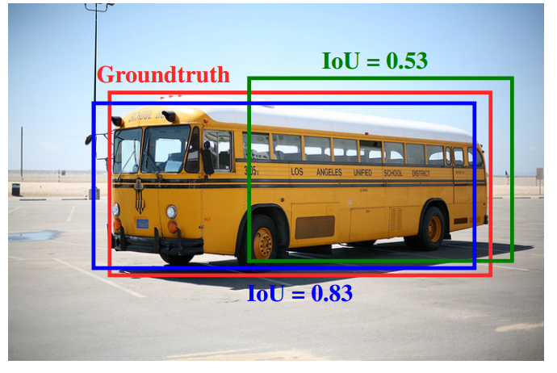
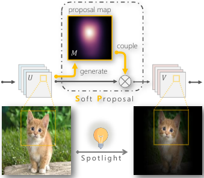
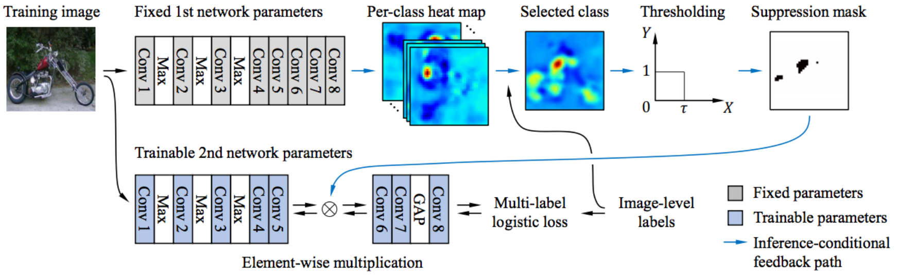

## Object Localization
|No.  |Figure   |Title   |Authors  |Pub.  |Links|
|------|:-----:|:-----:|:-----:|:-----:|:---:|
|6||__Improving Object Localization with Fitness NMS and Bounded IoU Loss__|Lachlan Tychsen-Smith, Lars Petersson|__CVPR 2018__|[`paper`](https://arxiv.org/abs/1711.00164v3) [`github`](https://github.com/lachlants/denet)|
|5||__Soft Proposal Networks for Weakly Supervised Object Localization__|Yi Zhu, Yanzhao Zhou, Qixiang Ye, Qiang Qiu and Jianbin Jiao|__ICCV 2017__|[`paper`](https://arxiv.org/abs/1709.01829) [`github`](https://github.com/ZhouYanzhao/SPN)|
|4||__Two-Phase Learning for Weakly Supervised Object Localization__|Dahun Kim, Donghyeon Cho, Donggeun Yoo, In So Kweon|__ICCV 2017__|[`paper`](https://arxiv.org/abs/1708.02108)|
|3||__Learning Detection with Diverse Proposals__|Samaneh Azadi, Jiashi Feng, Trevor Darrell|__CVPR 2017__|[`paper`](https://arxiv.org/abs/1704.03533)|
|2||__Deep Self-Taught Learning for Weakly Supervised Object Localization__|Zequn Jie, Yunchao Wei, Xiaojie Jin, Jiashi Feng, Wei Liu|__CVPR 2017__|[`paper`](https://arxiv.org/abs/1704.05188)|
|1||__Simultaneous Detection and Segmentation__|Bharath Hariharan, Pablo Arbeláez, Ross Girshick, Jitendra Malik|__ECCV 2014__|[`paper`](https://arxiv.org/abs/1407.1808) :star:|