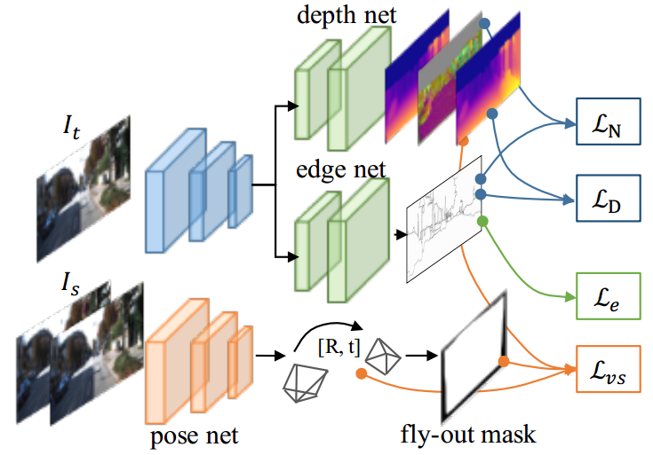

## Edge Detection
|No. |Figure   |Title   |Authors  |Pub.  |Links|
|-----|:-----:|:-----:|:-----:|:-----:|:---:|
|1||__Holistically-Nested Edge Detection__|Saining Xie, Zhuowen Tu|__ICCV 2015__|[`paper`](http://www.cv-foundation.org/openaccess/content_iccv_2015/papers/Xie_Holistically-Nested_Edge_Detection_ICCV_2015_paper.pdf) [`github`](https://github.com/s9xie/hed) :star:|
|2||__Richer Convolutional Features for Edge Detection__|Yun Liu, Ming-Ming Cheng, Xiaowei Hu, Kai Wang, Xiang Bai|__CVPR 2017__|[`paper`](https://arxiv.org/abs/1612.02103) [`project page`](http://mmcheng.net/rcfedge/)|
|3||__CASENet: Deep Category-Aware Semantic Edge Detection__|Zhiding Yu, Chen Feng, Ming-Yu Liu, Srikumar Ramalingam|__CVPR 2017__|[`paper`](https://arxiv.org/abs/1705.09759)|
|4||__LEGO: Learning Edge with Geometry all at Once by Watching Videos__|Zhenheng Yang, Peng Wang, Yang Wang, Wei Xu, Ram Nevatia|__CVPR 2018 (Spotlight)__|[`paper`](https://arxiv.org/abs/1803.05648v1)|