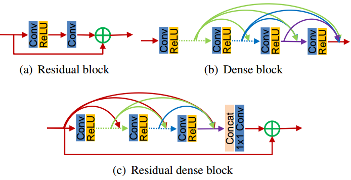
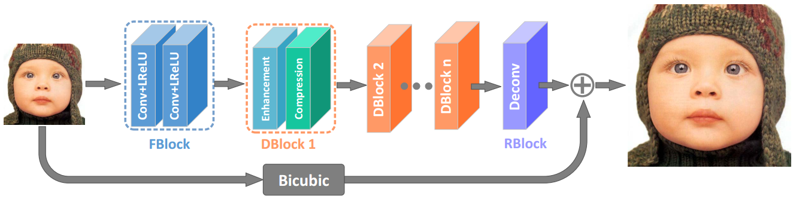

## Super Resolution
|No. |Figure   |Title   |Authors  |Pub.  |Links|
|------|:-----:|:-----:|:-----:|:-----:|:---:|
|1||__Deep Laplacian Pyramid Networks for Fast and Accurate Super-Resolution__|Wei-Sheng Lai, Jia-Bin Huang, Narendra Ahuja, Ming-Hsuan Yang|__CVPR 2017__|[`project page`](http://vllab1.ucmerced.edu/~wlai24/LapSRN/)|
|2||__Image Super-Resolution via Deep Recursive Residual Network__|Ying Tai, Jian Yang, and Xiaoming Liu|__CVPR 2017__|[`paper`](https://www.researchgate.net/profile/Xiaoming_Liu8/publication/316017318_Image_Super-Resolution_via_Deep_Recursive_Residual_Network/links/58eda40b0f7e9b37ed14f5d7/Image-Super-Resolution-via-Deep-Recursive-Residual-Network.pdf) [`github`](https://github.com/tyshiwo/DRRN_CVPR17)|
|3||__Residual Dense Network for Image Super-Resolution__|Yulun Zhang, Yapeng Tian, Yu Kong, Bineng Zhong, Yun Fu|__CVPR 2018 (Spotlight)__|[`paper`](https://arxiv.org/abs/1802.08797v2|
|4||__Fast and Accurate Single Image Super-Resolution via Information Distillation Network__|Zheng Hui, Xiumei Wang, Xinbo Gao|__CVPR 2018__|[`paper`](https://arxiv.org/abs/1803.09454v1) [`github`](https://github.com/Zheng222/IDN-Caffe)|