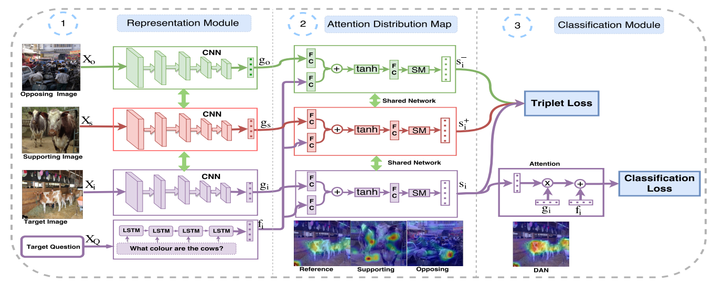
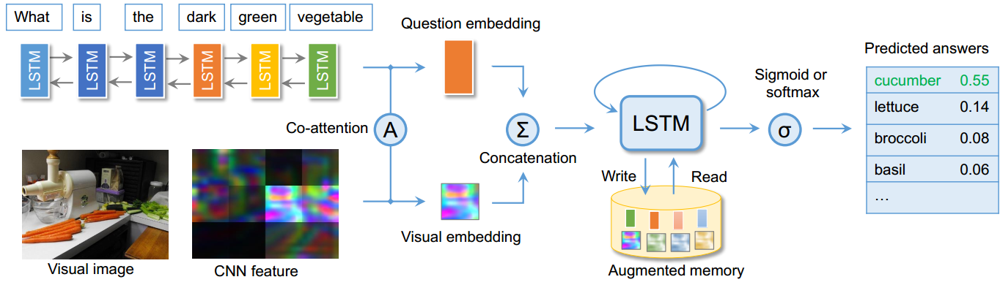
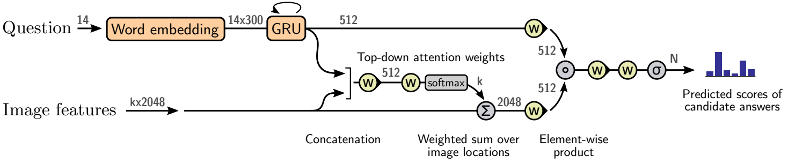

## Visual Question Answering
|No. |Figure   |Title   |Authors  |Pub.  |Links|
|-----|:-----:|:-----:|:-----:|:-----:|:---:|
|3||__Differential Attention for Visual Question Answering__|Badri Patro, Vinay P. Namboodiri|__CVPR 2018__|[`paper`](https://arxiv.org/abs/1804.00298v1) [`project`]( https://badripatro.github.io/DVQA/)|
|2||__Visual Question Answering with Memory-Augmented Networks__|Chao Ma, Chunhua Shen, Anthony Dick, Qi Wu, Peng Wang, Anton van den Hengel, and Ian Reid|__CVPR 2018__|[`paper`](https://arxiv.org/abs/1707.04968v2)|
|1||__Bottom-Up and Top-Down Attention for Image Captioning and Visual Question Answering__|Peter Anderson, Xiaodong He, Chris Buehler, Damien Teney, Mark Johnson, Stephen Gould, Lei Zhang|__CVPR 2018 (Oral)__|[`paper`](https://arxiv.org/abs/1707.07998v3) [`project`](http://www.panderson.me/up-down-attention/)|