## Others
|No.   |Figure   |Title   |Authors  |Pub.  |Links|
|-----|:-----:|:-----:|:-----:|:-----:|:---:|
|20|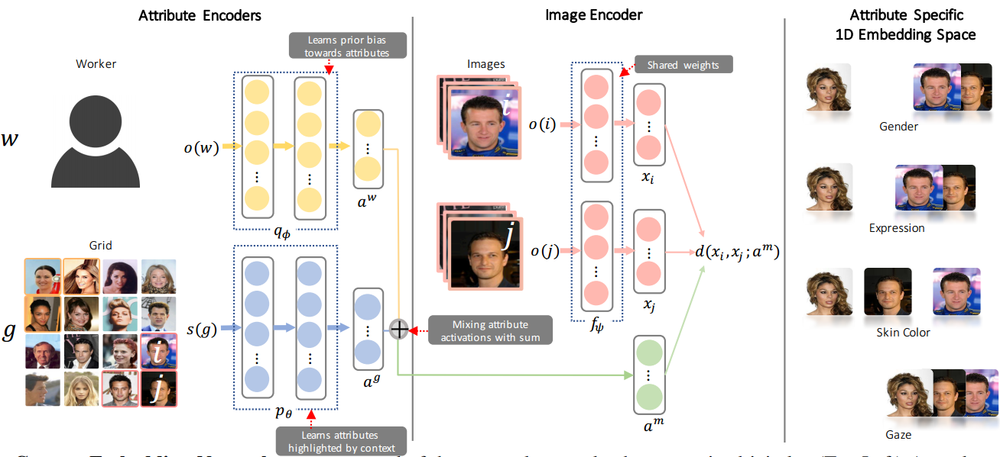|__Context Embedding Networks__|Kun Ho Kim, Oisin Mac Aodha, Pietro Perona|__CVPR 2018 (Spotlight)__|[`paper`](https://arxiv.org/abs/1710.01691v3)|
|19|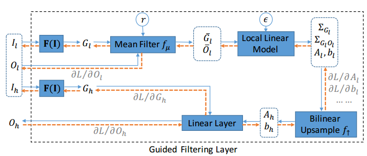|__Fast End-to-End Trainable Guided Filter__|Huikai Wu, Shuai Zheng, Junge Zhang, Kaiqi Huang|__CVPR 2018__|[`paper`](https://arxiv.org/abs/1803.05619v1) [`project`](http://wuhuikai.me/DeepGuidedFilterProject/)|
|18|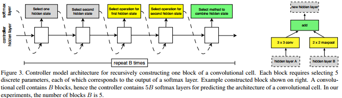|__Learning Transferable Architectures for Scalable Image Recognition__| Barret Zoph, Vijay Vasudevan, Jonathon Shlens, Quoc V. Le|__Tech Report__|[`paper`](https://arxiv.org/abs/1707.07012)|
|17|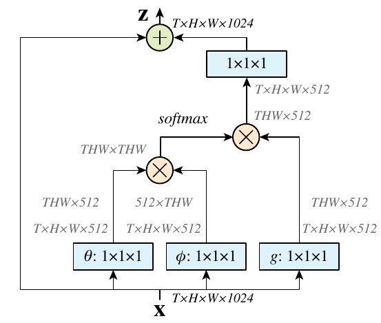|__Non-local Neural Networks__| Xiaolong Wang, Ross Girshick, Abhinav Gupta and Kaiming He|__CVPR 2018__|[`paper`](https://arxiv.org/abs/1711.07971)|
|16|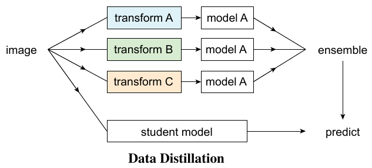|__Data Distillation: Towards Omni-Supervised Learning__| Ilija Radosavovic, Piotr Dollar, Ross Girshick, GeorgiaGkioxari and Kaiming He|__CVPR 2018__|[`paper`](https://arxiv.org/abs/1712.04440)|
|15|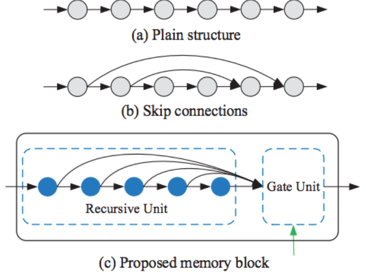|__MemNet: A Persistent Memory Network for Image Restoration__| Ying Tai, Jian Yang, Xiaoming Liu, Chunyan Xu|__ICCV 2017__|[`paper`](https://arxiv.org/abs/1708.02209) [`github`](https://github.com/tyshiwo/MemNet)|
|14|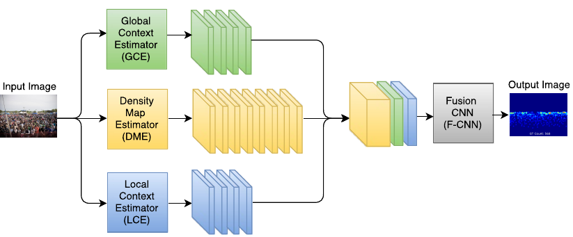|__Generating High-Quality Crowd Density Maps using Contextual Pyramid CNNs__|Vishwanath A. Sindagi and Vishal M. Patel|__ICCV 2017__|[`paper`](https://arxiv.org/abs/1708.00953)|
|13|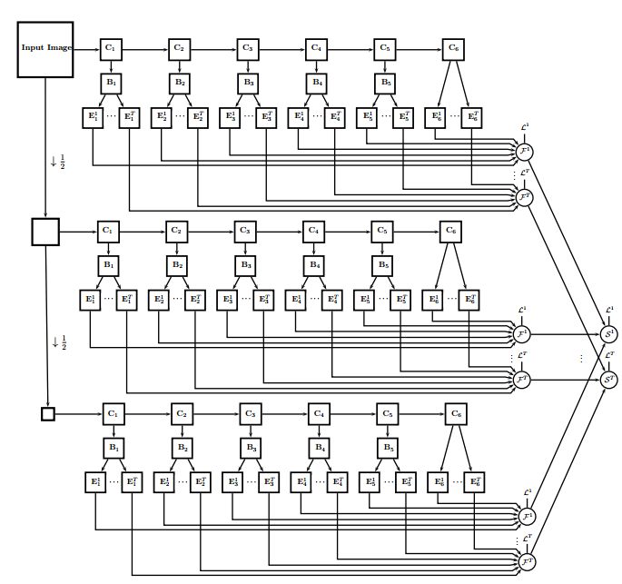|__UberNet: Training a `Universal' Convolutional Neural Network for Low-, Mid-, and High-Level Vision using Diverse Datasets and Limited Memory__|Iasonas Kokkinos|__CVPR 2017__|[`paper`](https://arxiv.org/abs/1609.02132) [`code`](http://cvn.ecp.fr/ubernet/)|
|12|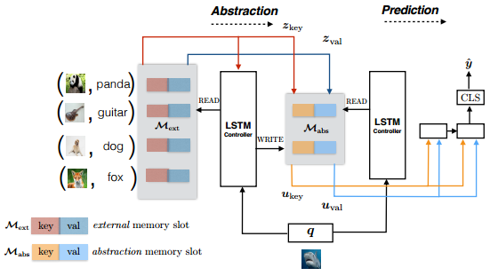|__Few-Shot Object Recognition from Machine-Labeled Web Images__|Zhongwen Xu, Linchao Zhu, Yi Yang|__CVPR 2017__|[`paper`](https://arxiv.org/abs/1612.06152)|
|11|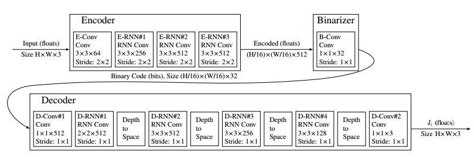|__Full Resolution Image Compression with Recurrent Neural Networks__|George Toderici, Damien Vincent, Nick Johnston, Sung Jin Hwang, David Minnen, Joel Shor, Michele Covell|__CVPR 2017__|[`paper`](https://arxiv.org/abs/1608.05148) [`github`](https://github.com/tensorflow/models/tree/master/compression)|
|10|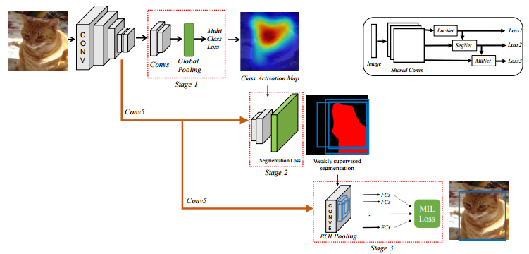|__Weakly Supervised Cascaded Convolutional Networks__|Ali Diba, Vivek Sharma, Ali Pazandeh, Hamed Pirsiavash, Luc Van Gool|__CVPR 2017__|[`paper`](https://arxiv.org/abs/1611.08258)|
|9||__Annotating Object Instances with a Polygon-RNN__|Lluis Castrejon, Kaustav Kundu, Raquel Urtasun, Sanja Fidler|__CVPR 2017__|[`paper`](https://arxiv.org/abs/1704.05548) :star:|
|8|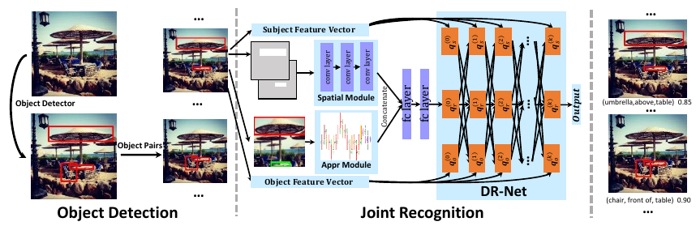|__Detecting Visual Relationships with Deep Relational Networks__|Bo Dai, Yuqi Zhang, Dahua Lin|__CVPR 2017__|[`paper`](https://arxiv.org/pdf/1704.03114.pdf) [`github`](https://github.com/doubledaibo/drnet)|
|7|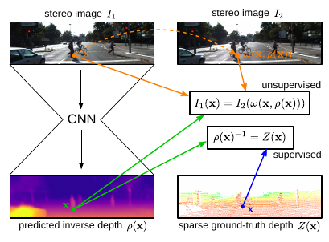|__Semi-Supervised Deep Learning for Monocular Depth Map Prediction__|Yevhen Kuznietsov, Jörg Stückler, Bastian Leibe|__CVPR 2017__|[`paper`](https://arxiv.org/abs/1702.02706)|
|6||__Learning Cross-Modal Deep Representations for Robust Pedestrian Detection__|Dan Xu, Wanli Ouyang, Elisa Ricci, Xiaogang Wang, Nicu Sebe|__CVPR 2017__|[`paper`](https://arxiv.org/abs/1704.02431)|
|5||__Multi-Scale Continuous CRFs as Sequential Deep Networks for Monocular Depth Estimation__|Dan Xu, Elisa Ricci, Wanli Ouyang, Xiaogang Wang, Nicu Sebe|__CVPR 2017__|[`paper`](https://arxiv.org/abs/1704.02157) [`github`](https://github.com/danxuhk/ContinuousCRF-CNN) :star:|
|4||__Quality Aware Network for Set to Set Recognition__|Yu Liu, Junjie Yan, Wanli Ouyang|__CVPR 2017__|[`paper`](https://arxiv.org/abs/1704.03373)|
|3||__SRN：Side-output Residual Network for Object Symmetry Detection in the Wild__|Wei Ke, Jie Chen, Jianbin Jiao, Guoying Zhao and Qixiang Ye|__CVPR 2017__|[`paper`](https://arxiv.org/abs/1703.02243) [`github`](https://github.com/KevinKecc/SRN) :star:|
|2||__AnchorNet: A Weakly Supervised Network to Learn Geometry-sensitive Features For Semantic Matching__|David Novotny, DianeLarlus, Andrea Vedaldi|__CVPR 2017__|[`paper`](https://arxiv.org/abs/1704.04749)|
|1|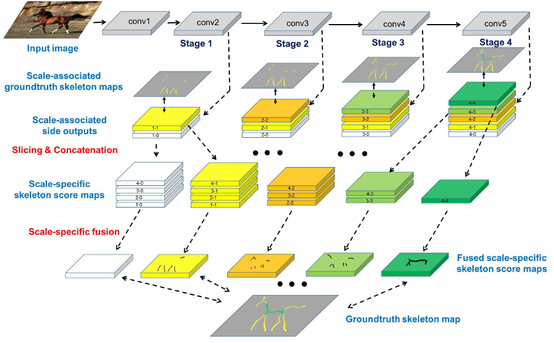|__Object Skeleton Extraction in Natural Images by Fusing Scale-associated Deep Side Outputs__|Wei Shen, Kai Zhao, Yuan Jiang, Yan Wang, Zhijiang Zhang, Xiang Bai|__ICCV 2016__|[`paper`](http://www.cv-foundation.org/openaccess/content_cvpr_2016/html/Shen_Object_Skeleton_Extraction_CVPR_2016_paper.html) [`github`](https://github.com/zeakey/DeepSkeleton)|