# CVPR 2017: Attention Models
- The goal of this document is to provide a reading list for CVPR 2017 papers related to Attention Model.

## Papers
Paper list.

|No.|Figure   |Title   |Authors  |Pub.  |Links|
|:-----:|:-----:|:-----:|:-----:|:---:|:------:|
|1|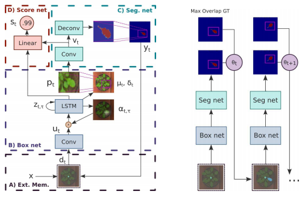|__End-to-End Instance Segmentation with Recurrent Attention__|Mengye Ren, Richard S. Zemel|__CVPR 2017__|[`paper`](http://openaccess.thecvf.com/content_cvpr_2017/papers/Ren_End-To-End_Instance_Segmentation_CVPR_2017_paper.pdf) [`github`](https://github.com/renmengye/rec-attend-public)|
|2|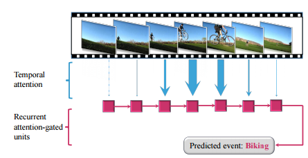|__Temporal Attention-Gated Model for Robust Sequence Classification__|Wenjie Pei, Tadas Baltrusaitis, David M.J. Tax and Louis-Philippe Morency|__CVPR 2017__|[`paper`](http://openaccess.thecvf.com/content_cvpr_2017/papers/Pei_Temporal_Attention-Gated_Model_CVPR_2017_paper.pdf) [`github`](https://github.com/wenjiepei/TAGM)|
|3|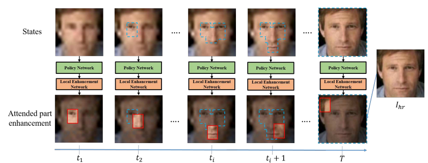|__Attention-Aware Face Hallucination via Deep Reinforcement Learning__|Qingxing Cao, Liang Lin, Yukai Shi, Xiaodan Liang, Guanbin Li|__CVPR 2017__|[`paper`](http://openaccess.thecvf.com/content_cvpr_2017/papers/Cao_Attention-Aware_Face_Hallucination_CVPR_2017_paper.pdf)|
|4|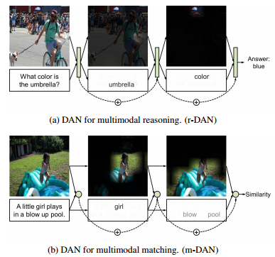|__Dual Attention Networks for Multimodal Reasoning and Matching__|Hyeonseob Nam, Jung-Woo Ha, Jeonghee Kim|__CVPR 2017__|[`paper`](http://openaccess.thecvf.com/content_cvpr_2017/papers/Nam_Dual_Attention_Networks_CVPR_2017_paper.pdf)|
|5|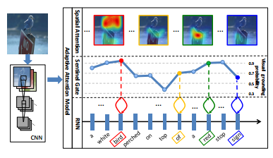|__Knowing When to Look: Adaptive Attention via A Visual Sentinel for Image Captioning__|Jiasen Lu, Caiming Xiong1, Devi Parikh, Richard Socher|__CVPR 2017__|[`paper`](http://openaccess.thecvf.com/content_cvpr_2017/papers/Lu_Knowing_When_to_CVPR_2017_paper.pdf) [`github`](https://github.com/jiasenlu/AdaptiveAttention)|
|6|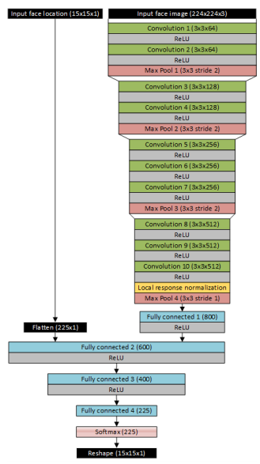|__Attentional Push: A Deep Convolutional Network for Augmenting Image Salience With Shared Attention Modeling in Social Scenes__|Siavash Gorji, James J. Clark|__CVPR 2017__|[`paper`](http://openaccess.thecvf.com/content_cvpr_2017/papers/Gorji_Attentional_Push_A_CVPR_2017_paper.pdf)|
|7|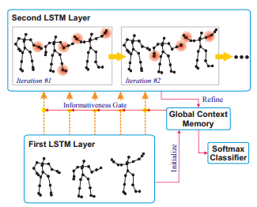|__Global Context-Aware Attention LSTM Networks for 3D Action Recognition__|Jun Liu, Gang Wang, Ping Hu, Ling-Yu Duan, Alex C. Kot|__CVPR 2017__|[`paper`](http://openaccess.thecvf.com/content_cvpr_2017/papers/Liu_Global_Context-Aware_Attention_CVPR_2017_paper.pdf)|
|8|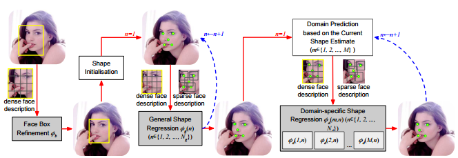|__Dynamic Attention-Controlled Cascaded Shape Regression Exploiting Training Data Augmentation and Fuzzy-Set Sample Weighting__|Zhen-Hua Feng, Josef Kittler, William Christmas, Patrik Huber, Xiao-Jun Wu|__CVPR 2017__|[`paper`](http://openaccess.thecvf.com/content_cvpr_2017/papers/Feng_Dynamic_Attention-Controlled_Cascaded_CVPR_2017_paper.pdf) [`github`](https://github.com/FengZhenhua/DAC-CSR)|
|9|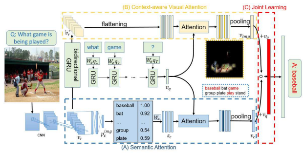|__Multi-Level Attention Networks for Visual Question Answering__|Dongfei Yu, Jianlong Fu, Tao Mei, Yong Rui|__CVPR 2017__|[`paper`](http://openaccess.thecvf.com/content_cvpr_2017/papers/Yu_Multi-Level_Attention_Networks_CVPR_2017_paper.pdf)|
|10|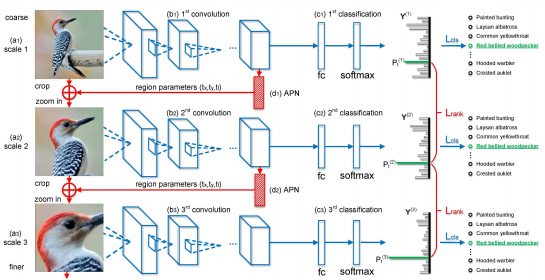|__Look Closer to See Better: Recurrent Attention Convolutional Neural Network for Fine-Grained Image Recognition__|Jianlong Fu, Heliang Zheng, Tao Mei|__CVPR 2017__|[`paper`](http://openaccess.thecvf.com/content_cvpr_2017/papers/Fu_Look_Closer_to_CVPR_2017_paper.pdf) [`github`](https://github.com/Jianlong-Fu/Recurrent-Attention-CNN)|
|11|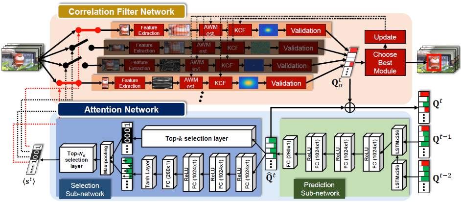|__Attentional Correlation Filter Network for Adaptive Visual Tracking__|Jongwon Choi, Hyung Jin Chang, Sangdoo Yun, Tobias Fischer, Yiannis Demiris, Jin Young Choi|__CVPR 2017__|[`paper`](http://openaccess.thecvf.com/content_cvpr_2017/papers/Choi_Attentional_Correlation_Filter_CVPR_2017_paper.pdf) [`code`](https://sites.google.com/site/jwchoivision/home/acfn-1)|
|12|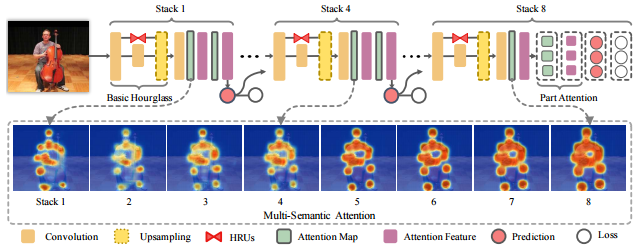|__Multi-Context Attention for Human Pose Estimation__|Xiao Chu, Wei Yang, Wanli Ouyang, Cheng Ma, Alan L. Yuille, Xiaogang Wang|__CVPR 2017__|[`paper`](http://openaccess.thecvf.com/content_cvpr_2017/papers/Chu_Multi-Context_Attention_for_CVPR_2017_paper.pdf) [`github`](https://github.com/bearpaw/pose-attention)|
|13|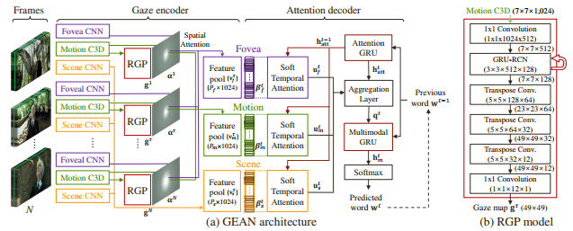|__Supervising Neural Attention Models for Video Captioning by Human Gaze Data__|Youngjae Yu, Jongwook Choi, Yeonhwa Kim, Kyung Yoo, Sang-Hun Lee, Gunhee Kim|__CVPR 2017__|[`paper`](http://openaccess.thecvf.com/content_cvpr_2017/papers/Yu_Supervising_Neural_Attention_CVPR_2017_paper.pdf)|
|14|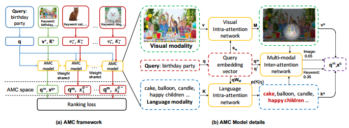|__AMC: Attention guided Multi-modal Correlation Learning for Image Search__|Kan Chen, Trung Bui, Chen Fang, Zhaowen Wang, Ram Nevatia|__CVPR 2017__|[`paper`](http://openaccess.thecvf.com/content_cvpr_2017/papers/Chen_AMC_Attention_guided_CVPR_2017_paper.pdf) [`github`](https://github.com/kanchen-usc/amc_att)|
|15|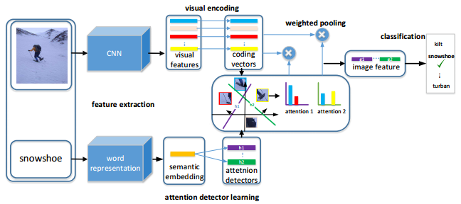|__Multi-Attention Network for One Shot Learning__|Peng Wang, Lingqiao Liu, Chunhua Shen, Zi Huang, Anton van den Hengel, Heng Tao Shen|__CVPR 2017__|[`paper`](http://openaccess.thecvf.com/content_cvpr_2017/papers/Wang_Multi-Attention_Network_for_CVPR_2017_paper.pdf)|
|16|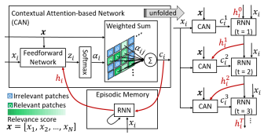|__Episodic CAMN: Contextual Attention-Based Memory Networks With Iterative Feedback for Scene Labeling__|Abrar H. Abdulnabi, Bing Shuai, Stefan Winkler, Gang Wang|__CVPR 2017__|[`paper`](http://openaccess.thecvf.com/content_cvpr_2017/papers/Abdulnabi_Episodic_CAMN_Contextual_CVPR_2017_paper.pdf)|
|17|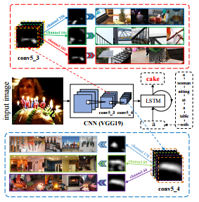|__SCA-CNN: Spatial and Channel-Wise Attention in Convolutional Networks for Image Captioning__|Long Chen, Hanwang Zhang, Jun Xiao, Liqiang Nie, Jian Shao, Wei Liu, Tat-Seng Chua|__CVPR 2017__|[`paper`](http://openaccess.thecvf.com/content_cvpr_2017/papers/Chen_SCA-CNN_Spatial_and_CVPR_2017_paper.pdf) [`github`](https://github.com/zjuchenlong/sca-cnn)|
|18|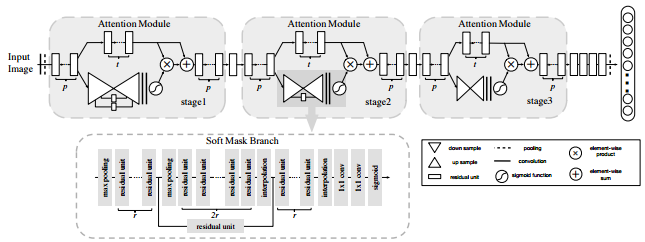|__Residual Attention Network for Image Classification__|Fei Wang, Mengqing Jiang, Chen Qian, Shuo Yang, Cheng Li, Honggang Zhang, Xiaogang Wang, Xiaoou Tang|__CVPR 2017__|[`paper`](http://openaccess.thecvf.com/content_cvpr_2017/papers/Wang_Residual_Attention_Network_CVPR_2017_paper.pdf) [`github`](https://github.com/buptwangfei/residual-attention-network)|