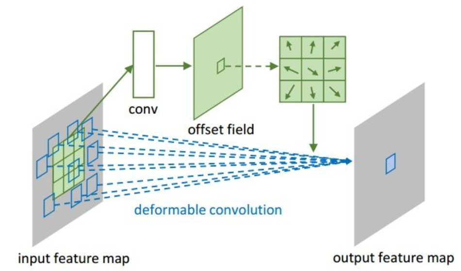
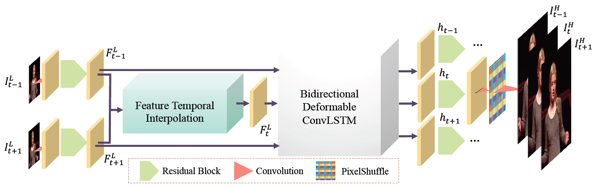

# Paper List
- The goal of this document is to provide a reading list for papers related to Deformable Convolution Network.

## Papers
Paper list.

|No.|Figure   |Title   |Authors  |Pub.  |Links|
|:-----:|:-----:|:-----:|:-----:|:---:|:------:|
|0||__Deformable Convolutional Networks__|Jifeng Dai, Haozhi Qi, Yuwen Xiong, Yi Li, Guodong Zhang, Han Hu, Yichen Wei|__ICCV 2017__|[`paper`](http://openaccess.thecvf.com/content_ICCV_2017/papers/Dai_Deformable_Convolutional_Networks_ICCV_2017_paper.pdf)|
|1||__Classifying, Segmenting, and Tracking Object Instances in Video with Mask Propagation__|Gedas Bertasius, Lorenzo Torresani|__arXiv__|[`paper`](https://arxiv.org/abs/1912.04573)|
|2||__TDAN: Temporally Deformable Alignment Network for Video Super-Resolution__|Yapeng Tian, Yulun Zhang, Yun Fu, and Chenliang Xu|__arXiv__|[`paper`](https://arxiv.org/abs/1812.02898)|
|3||__Zooming Slow-Mo: Fast and Accurate One-Stage Space-Time Video Super-Resolution__|Xiaoyu Xiang, Yapeng Tian, Yulun Zhang|__CVPR 2020__|[`paper`](https://arxiv.org/abs/2002.11616)|
|4||__Learning Deformable Kernels for Image and Video Denoising__|Xiangyu Xu, Muchen Li, Wenxiu Sun|__arXiv__|[`paper`](https://arxiv.org/abs/1904.06903)|
|5||__ADCrowdNet: An Attention-Injective Deformable Convolutional Network for Crowd Understanding__|Ning Liu, Yongchao Long, Changqing Zou, Qun Niu, Li Pan, Hefeng Wu|__CVPR 2019__|[`paper`](http://openaccess.thecvf.com/content_CVPR_2019/papers/Liu_ADCrowdNet_An_Attention-Injective_Deformable_Convolutional_Network_for_Crowd_Understanding_CVPR_2019_paper.pdf)|
