## Salient Object Detection

### 2019
|No.   |Figure   |Title   |Authors  |Pub.  |Links|
|-----|:-----:|:-----:|:-----:|:-----:|:---:|
|3|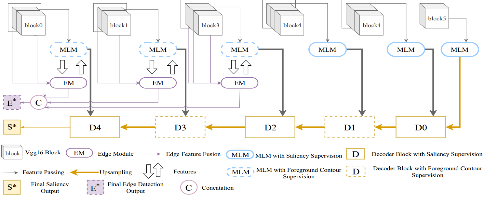|__A Mutual Learning Method for Salient Object Detection with intertwined Multi-Supervision__|Runmin Wu, Huchuan Lu|__CVPR 2019__|COMING SOON|
|2|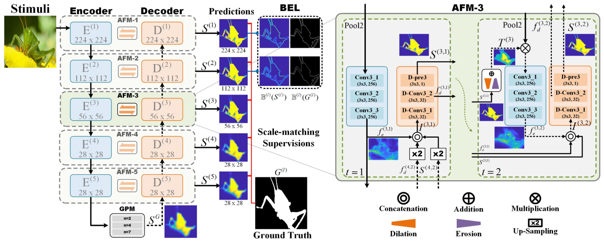|__Attentive Feedback Network for Boundary-aware Salient Object Detection__|Mengyang Feng, Huchuan Lu|__CVPR 2019__|[`github`](https://github.com/ArcherFMY/AFNet)|
|1|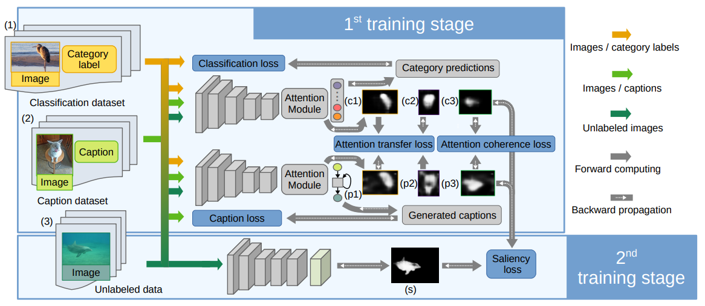|__multi-source weak supervision for saliency detection__|Yu Zeng, Huchuan Lu|__CVPR 2019__|[`github`](https://github.com/zengxianyu/mws)|

### 2018
|No.   |Figure   |Title   |Authors  |Pub.  |Links|
|-----|:-----:|:-----:|:-----:|:-----:|:---:|
|8|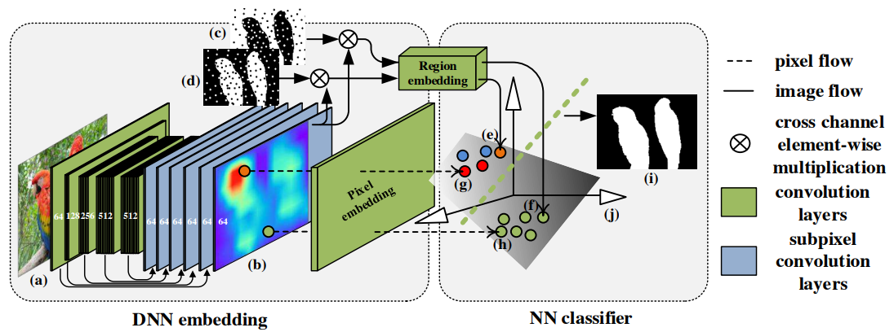|__Learning to Promote Saliency Detectors__|Yu Zeng, Huchuan Lu, Lihe Zhang, Mengyang Feng, Ali Borji|__CVPR 2018__|[`paper`](http://openaccess.thecvf.com/content_cvpr_2018/papers/Zeng_Learning_to_Promote_CVPR_2018_paper.pdf) [`github`](https://github.com/zengxianyu/lps)|
|7|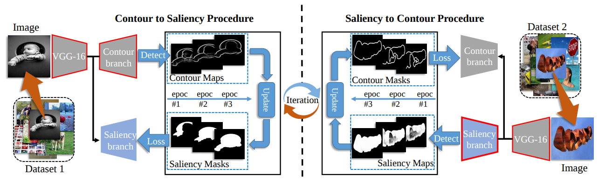|__Contour Knowledge Transfer for Salient Object Detection__|Xin Li, Fan Yang, Hong Cheng, Wei Liu, Dinggang Shen|__ECCV 2018__|[`paper`](http://openaccess.thecvf.com/content_ECCV_2018/papers/Xin_Li_Contour_Knowledge_Transfer_ECCV_2018_paper.pdf) [`github`](https://github.com/lixin666/C2SNet)|
|6|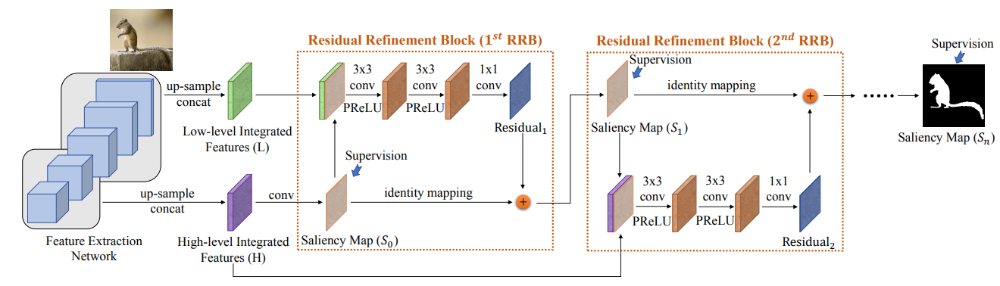|__R3Net: Recurrent Residual Refinement Network for Saliency Detection__|Zijun Deng, Xiaowei Hu, Lei Zhu, Xuemiao Xu, Jing Qin, Guoqiang Han, and Pheng-Ann Heng|__IJCAI 2018__|[`paper`](https://www.ijcai.org/proceedings/2018/0095.pdf) [`github`](https://github.com/zijundeng/R3Net)|
|5|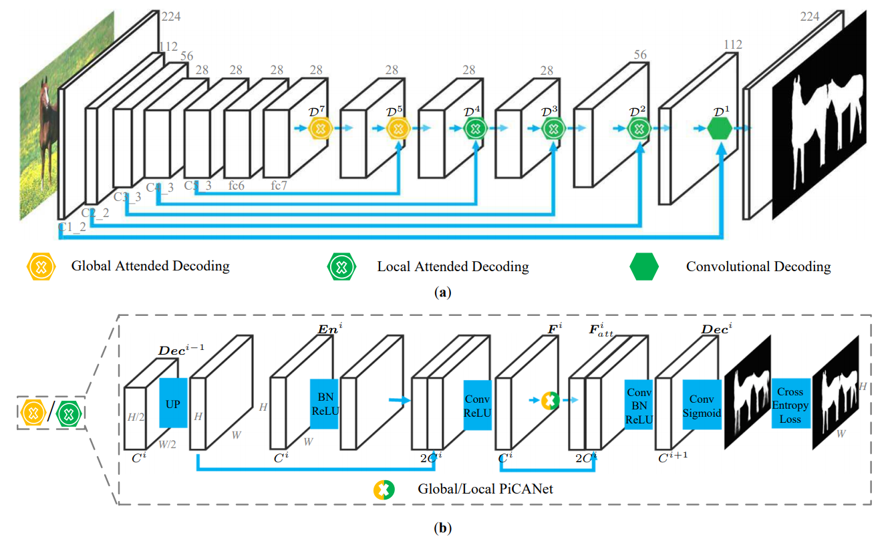|__PiCANet: Learning Pixel-Wise Contextual Attention for Saliency Detection__|Nian Liu, Junwei Han, Ming-Hsuan Yang|__CVPR 2018__|[`paper`](http://openaccess.thecvf.com/content_cvpr_2018/papers/Liu_PiCANet_Learning_Pixel-Wise_CVPR_2018_paper.pdf) [`github`](https://github.com/nian-liu/PiCANet)|
|4|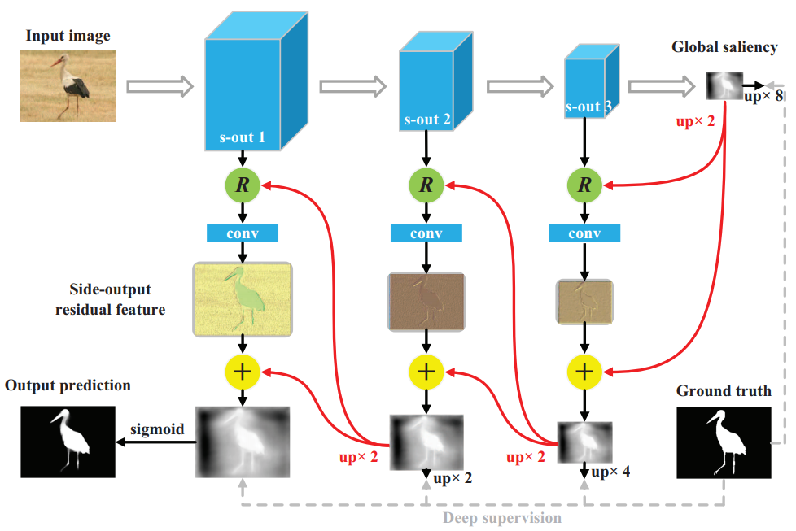|__Reverse Attention for Salient Object Detection__|Shuhan Chen, Xiuli Tan, Ben Wang and Xuelong Hu|__ECCV 2018__|[`paper`](http://openaccess.thecvf.com/content_ECCV_2018/papers/Shuhan_Chen_Reverse_Attention_for_ECCV_2018_paper.pdf) [`github`](https://github.com/ShuhanChen/RAS_ECCV18)|
|3|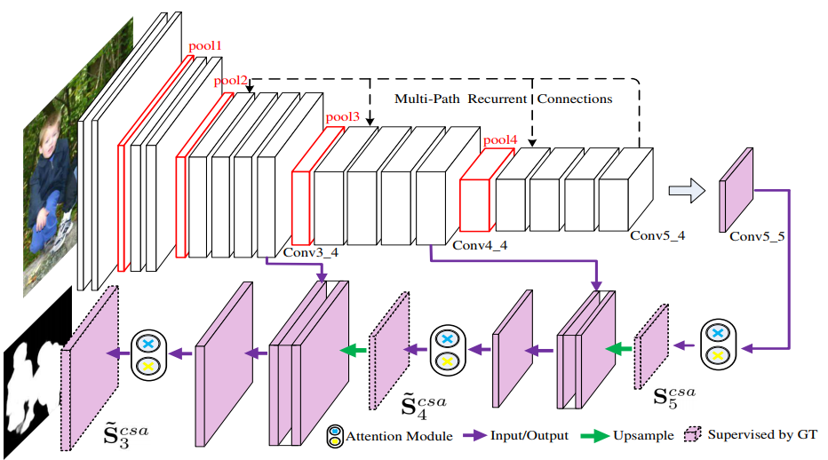|__Progressive Attention Guided Recurrent Network for Salient Object Detection__|Xiaoning Zhang, Tiantian Wang, Jinqing Qi, Huchuan Lu, Gang Wang|__CVPR 2018__|[`paper`](http://openaccess.thecvf.com/content_cvpr_2018/papers/Zhang_Progressive_Attention_Guided_CVPR_2018_paper.pdf) [`github`](https://github.com/zhangxiaoning666/PAGR)|
|2|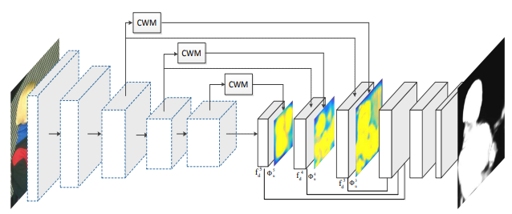|__Detect Globally, Refine Locally: A Novel Approach to Saliency Detection__|Tiantian Wang, Lihe Zhang, Shuo Wang, Huchuan Lu, Gang Yang, Xiang Ruan, Ali Borji|__CVPR 2018__|[`paper`](http://openaccess.thecvf.com/content_cvpr_2018/papers/Wang_Detect_Globally_Refine_CVPR_2018_paper.pdf) [`github`](https://github.com/TiantianWang/CVPR18_detect_globally_refine_locally)|
|1|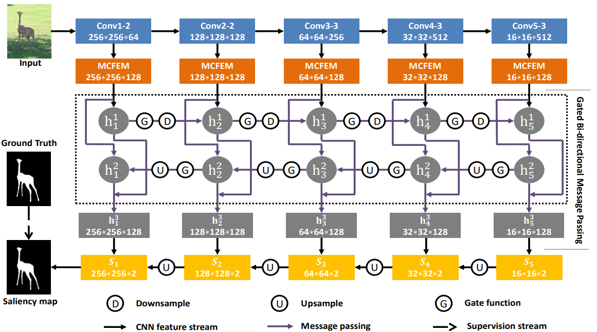|__A Bi-Directional Message Passing Model for Salient Object Detection__|Lu Zhang, Ju Dai, Huchuan Lu, You He, Gang Wang|__CVPR 2018__|[`paper`](http://openaccess.thecvf.com/content_cvpr_2018/papers/Zhang_A_Bi-Directional_Message_CVPR_2018_paper.pdf)|

### 2017
|No.   |Figure   |Title   |Authors  |Pub.  |Links|
|-----|:-----:|:-----:|:-----:|:-----:|:---:|
|7|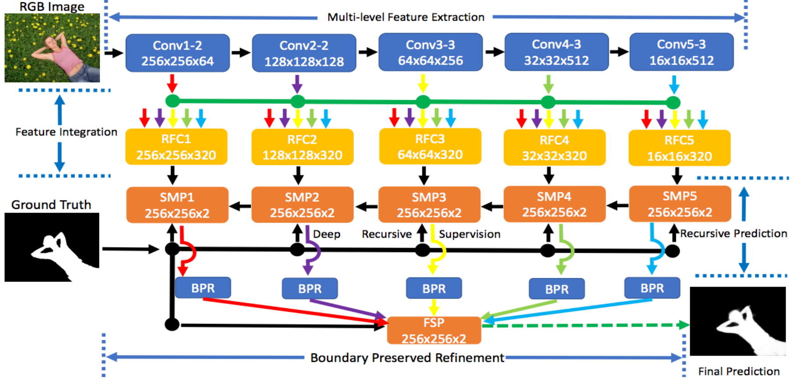|__Amulet: Aggregating Multi-level Convolutional Features for Salient Object Detection__|Pingping Zhang, Dong Wang, Huchuan Lu, Hongyu Wang, Xiang Ruan|__ICCV 2017__|[`paper`](https://arxiv.org/abs/1708.02001) [`github`](https://github.com/Pchank/caffe-sal)|
|6|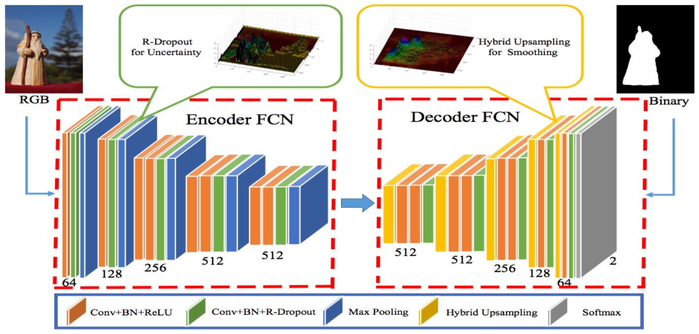|__Learning Uncertain Convolutional Features for Accurate Saliency Detection__|Pingping Zhang, Dong Wang, Huchuan Lu, Hongyu Wang, Baocai Yin|__ICCV 2017__|[`paper`](https://arxiv.org/abs/1708.02031) [`github`](https://github.com/Pchank/caffe-sal)|
|5|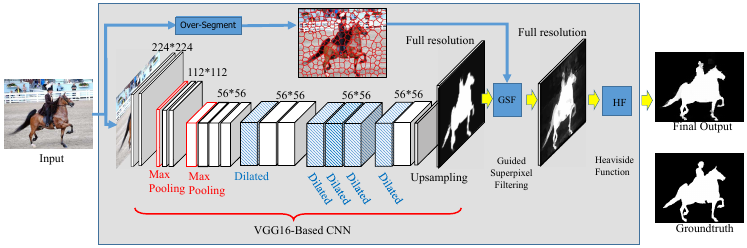|__Deep Level Sets for Salient Object Detection__|Ping Hu, Bing Shuai, Jun Liu, Gang Wang|__CVPR 2017__|[`paper`](http://openaccess.thecvf.com/content_cvpr_2017/papers/Hu_Deep_Level_Sets_CVPR_2017_paper.pdf)|
|4||__Learning to Detect Salient Objects with Image-level Supervision__|Lijun Wang, Huchuan Lu, Yifan Wang, Mengyang Feng, Dong Wang, Baocai Yin , Xiang Ruan|__CVPR 2017__|[`paper`](http://saliencydetection.net/duts/download/camera_ready.pdf) [`github`](https://github.com/scott89/WSS)|
|3||__Instance-Level Salient Object Segmentation__|[Guanbin Li](https://sites.google.com/site/ligb86/), Yuan Xie, Liang Lin, Yizhou Yu|__CVPR 2017__|[`paper`](https://arxiv.org/pdf/1704.03604.pdf) [`github`](https://github.com/Xyuan13/MSRNet)|
|2||__Non-Local Deep Features for Salient Object Detection__|Zhiming Luo, Akshaya Mishra , Andrew Achkar , Justin Eichel , Shaozi Li , Pierre-Marc.Jodoin|__CVPR 2017__|[`project page`](https://sites.google.com/view/zhimingluo/nldf)|
|1||__Deeply Supervised Salient Object Detection with Short Connections__|Qibin Hou, [Ming-Ming Cheng](http://mmcheng.net/cmm/), Xiaowei Hu, Ali Borji, [Zhuowen Tu](http://pages.ucsd.edu/~ztu/), Philip Torr|__CVPR 2017__|[`paper`](https://arxiv.org/abs/1611.04849) [`github`](https://github.com/Andrew-Qibin/DSS) :star:|

### 2016
|No.   |Figure   |Title   |Authors  |Pub.  |Links|
|-----|:-----:|:-----:|:-----:|:-----:|:---:|
|8||__Saliency Detection with Recurrent Fully Convolutional Networks__|Linzhao Wang, Lijun Wang, Huchuan Lu, Pingping Zhang, Xiang Ruan|__ECCV 2016__|[`paper`](https://www.researchgate.net/profile/Pingping_Zhang6/publication/308278832_Saliency_Detection_with_Recurrent_Fully_Convolutional_Networks/links/584b5da208aecb6bd8c157e0/Saliency-Detection-with-Recurrent-Fully-Convolutional-Networks.pdf) [`code`](https://drive.google.com/file/d/0B5rfGpkt3dDaODFRZ0ZXZjQyWDg/view)|
|7||__A Shape-Based Approach for Salient Object Detection Using Deep Learning__|[Jongpil Kim](http://www.research.cs.rutgers.edu/~jpkim/), Vladimir Pavlovic|__ECCV 2016__|[`paper`](http://www.research.cs.rutgers.edu/~jpkim/papers/jpkim_eccv2016.pdf) [`Pre-computed Maps`](http://www.research.cs.rutgers.edu/~jpkim/papers/resources/ssd_hs.tar.gz)|
|6||__DeepSaliency: Multi-Task Deep Neural Network Model for Salient Object Detection__|Xi Li, Liming Zhao, Lina Wei, Ming-Hsuan Yang, Fei Wu, Yueting Zhuang, Haibin Ling, Jingdong Wang|__TIP 2016__|[`project page`](http://www.zhaoliming.net/research/deepsaliency)|
|5||__Recurrent Attentional Networks for Saliency Detection__|Jason Kuen, Zhenhua Wang, Gang Wang|__CVPR 2016__|[`paper`](http://www.cv-foundation.org/openaccess/content_cvpr_2016/papers/Kuen_Recurrent_Attentional_Networks_CVPR_2016_paper.pdf)|
|4||__Deep Saliency with Encoded Low level Distance Map and High Level Features__|Gayoung Lee, Yu-Wing Tai, Junmo Kim|__CVPR 2016__|[`paper`](http://www.cv-foundation.org/openaccess/content_cvpr_2016/papers/Lee_Deep_Saliency_With_CVPR_2016_paper.pdf) [`code`](https://github.com/gylee1103/SaliencyELD)|
|3||__Saliency Unified: A Deep Architecture for Simultaneous Eye Fixation Prediction and Salient Object Segmentation__|Srinivas S S Kruthiventi, Vennela Gudisa, Jaley H Dholakiya and R. Venkatesh Babu|__CVPR 2016__|[`project page`](http://val.serc.iisc.ernet.in/saliency-unified/)|
|2||__Deep Contrast Learning for Salient Object Detection__|[Guanbin Li](https://sites.google.com/site/ligb86/), Yizhou Yu|__CVPR 2016__|[`project page`](http://i.cs.hku.hk/~gbli/deep_saliency.html)|
|1||__DHSNet: Deep Hierarchical Saliency Network for Salient Object Detection__|[Nian Liu](https://sites.google.com/site/liunian228/), Junwei Han|__CVPR 2016__|[`paper`](http://www.cv-foundation.org/openaccess/content_cvpr_2016/papers/Liu_DHSNet_Deep_Hierarchical_CVPR_2016_paper.pdf) [`Google Drive`](https://drive.google.com/file/d/0B1sbejbIJIW3RlJJY1NNNkFydEU/view) [`Baidu Yun`](https://pan.baidu.com/s/1jIm8cfk) :star:|

### 2015
|No.   |Figure   |Title   |Authors  |Pub.  |Links|
|-----|:-----:|:-----:|:-----:|:-----:|:---:|
|3||__Deep Networks for Saliency Detection via Local Estimation and Global Search__|Lijun Wang, Huchuan Lu, Xiang Ruan, Ming-Hsuan Yang|__CVPR 2015__|[`paper`](http://www.cv-foundation.org/openaccess/content_cvpr_2015/papers/Wang_Deep_Networks_for_2015_CVPR_paper.pdf) [`code`](https://drive.google.com/file/d/0B5rfGpkt3dDaVmhucE1jTVZGeTA/view)|
|2||__Saliency Detection by Multi-context Deep Learning__|[Rui Zhao](http://www.ee.cuhk.edu.hk/~rzhao/), Wanli Ouyang, Hongsheng Li, Xiaogang Wang|__CVPR 2015__|[`paper`](http://www.ee.cuhk.edu.hk/~rzhao/project/deepsal_cvpr15/zhaoOLWcvpr15.pdf) [`code`](https://github.com/Robert0812/deepsaldet)|
|1||__Visual Saliency Based on Multiscale Deep Features__|[Guanbin Li](https://sites.google.com/site/ligb86/), Yizhou Yu|__CVPR 2015__|[`project page`](https://sites.google.com/site/ligb86/mdfsaliency/)|