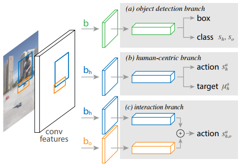
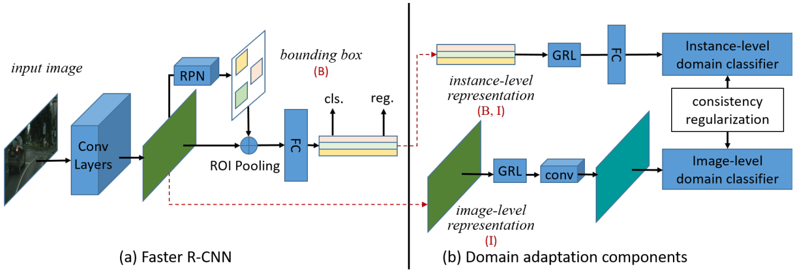
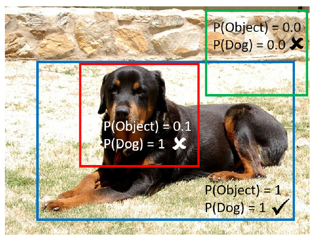
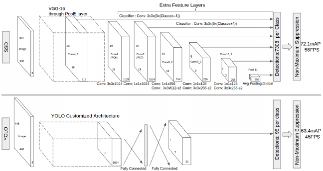
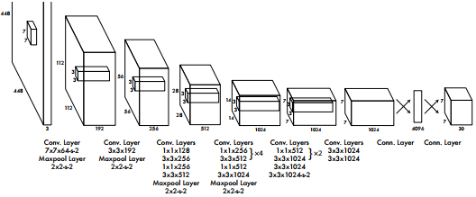

## Object Detection
### 2018
|No.   |Figure   |Title   |Authors  |Pub.  |Links|
|-----|:-----:|:-----:|:-----:|:-----:|:---:|
|2||__Detecting and Recognizing Human-Object Interactions__|Georgia Gkioxari, Ross Girshick, Piotr Dollar, Kaiming He|__CVPR 2018 (Spotlight)__|[`paper`](https://arxiv.org/abs/1704.07333v3) [`github`](https://github.com/facebookresearch/Detectron)|
|1||__Domain Adaptive Faster R-CNN for Object Detection in the Wild__|Yuhua Chen, Wen Li, Christos Sakaridis, Dengxin Dai, Luc Van Gool|__CVPR 2018__|[`paper`](https://arxiv.org/abs/1803.03243v1) [`github`](https://github.com/yuhuayc/da-faster-rcnn)|

### 2017
|No.   |Figure   |Title   |Authors  |Pub.  |Links|
|-----|:-----:|:-----:|:-----:|:-----:|:---:|
|5||__R-FCN-3000 at 30fps: Decoupling Detection and Classification__|Bharat Singh, Hengdou Li, Abhishek Sharma and Larry S. Davis|__Tech Report__|[`paper`](https://arxiv.org/abs/1712.01802)|
|4||__Multiple Instance Detection Network with Online Instance Classifier Refinement__|Peng Tang, Xinggang Wang, Xiang Bai, Wenyu Liu|__CVPR 2017__|[`paper`](https://arxiv.org/abs/1704.00138)|
|3||__A-Fast-RCNN: Hard Positive Generation via Adversary for Object Detection__|Xiaolong Wang, Abhinav Shrivastava, Abhinav Gupta|__CVPR 2017__|[`paper`](https://arxiv.org/abs/1704.03414)  [`github`](https://github.com/xiaolonw/adversarial-frcnn) :star:|
|2||__Mask R-CNN__|Kaiming He, Georgia Gkioxari, Piotr Dollár, Ross Girshick|__ICCV 2017 (Best Paper)__|[`paper`](https://arxiv.org/abs/1703.06870) :star: [`github`](https://github.com/facebookresearch/Detectron)|
|1||__Feature Pyramid Networks for Object Detection__|Tsung-Yi Lin, Piotr Dollár, Ross Girshick, [Kaiming He](http://kaiminghe.com/), Bharath Hariharan, and Serge Belongie|__CVPR 2017__|[`paper`](https://arxiv.org/pdf/1612.03144.pdf) [`github`](https://github.com/facebookresearch/Detectron)|

### 2016
|No.   |Figure   |Title   |Authors  |Pub.  |Links|
|-----|:-----:|:-----:|:-----:|:-----:|:---:|
|4||__SSD: Single Shot MultiBox Detector__|Wei Liu, Dragomir Anguelov, Dumitru Erhan, Christian Szegedy, Scott Reed, Cheng-Yang Fu, Alexander C. Berg|__ECCV 2016__|[`paper`](https://arxiv.org/abs/1512.02325) [`github`]( https://github.com/weiliu89/caffe/tree/ssd) :star:|
|3||__You Only Look Once: Unified, Real_Time Object Detection__|Joseph Redmon, Santosh Divvala, Ross Girshick, Ali Farhadi|__CVPR 2016__|[`paper`](https://arxiv.org/abs/1506.02640) [`project page`](http://pjreddie.com/yolo) :star:|
|2||__R-FCN: Object Detection via Region-based Fully Convolutional Networks__|Jifeng Dai, Yi Li, [Kaiming He](http://kaiminghe.com/), Jian Sun|__NIPS 2016__|[`paper`](https://arxiv.org/abs/1605.06409) [`github`](https://github.com/daijifeng001/R-FCN)|
|1||__Instance-aware Semantic Segmentation via Multi-task Network Cascades__|Jifeng Dai, [Kaiming He](http://kaiminghe.com/), Jian Sun|__CVPR 2016__|[`paper`](http://www.cv-foundation.org/openaccess/content_cvpr_2016/papers/Dai_Instance-Aware_Semantic_Segmentation_CVPR_2016_paper.pdf) [`github`](https://github.com/daijifeng001/MNC) :star:|

### 2015
|No.   |Figure   |Title   |Authors  |Pub.  |Links|
|-----|:-----:|:-----:|:-----:|:-----:|:---:|
|4||__Convolutional Feature Masking for Joint Object and Stuff Segmentation__|Jifeng Dai, [Kaiming He](http://kaiminghe.com/), Jian Sun|__CVPR 2015__|[`paper`](http://www.cv-foundation.org/openaccess/content_cvpr_2015/papers/Dai_Convolutional_Feature_Masking_2015_CVPR_paper.pdf)|
|3||__Faster R-CNN: Towards Real-Time Object Detection with Region Proposal Networks__|Shaoqing Ren, [Kaiming He](http://kaiminghe.com/), Ross Girshick, Jian Sun|__NIPS 2015__|[`paper`](http://papers.nips.cc/paper/5638-faster-r-cnn-towards-real-time-object-detection-with-region-proposal-networks.pdf) [`matlab`](https://github.com/ShaoqingRen/faster_rcnn) [`python`](https://github.com/rbgirshick/py-faster-rcnn) [`pytorch`](https://github.com/longcw/faster_rcnn_pytorch) :star:|
|2||__Fast R-CNN__|Ross Girshick|__ICCV 2015__|[`paper`](http://www.cv-foundation.org/openaccess/content_iccv_2015/papers/Girshick_Fast_R-CNN_ICCV_2015_paper.pdf) [`github`](https://github.com/rbgirshick/fast-rcnn) :star:|
|1||__Rich feature hierarchies for accurate object detection and semantic segmentation__|Ross Girshick, Jeff Donahue, Trevor Darrell, Jitendra Malik|__CVPR 2014__|[`paper`](http://www.cv-foundation.org/openaccess/content_cvpr_2014/papers/Girshick_Rich_Feature_Hierarchies_2014_CVPR_paper.pdf) [`github`](https://github.com/rbgirshick/rcnn) :star:|
