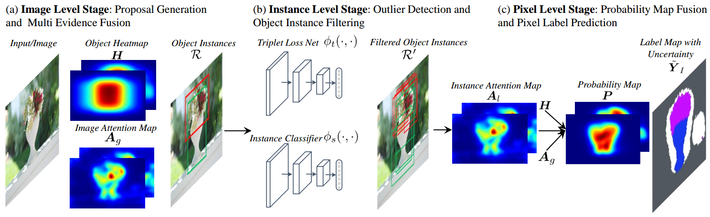
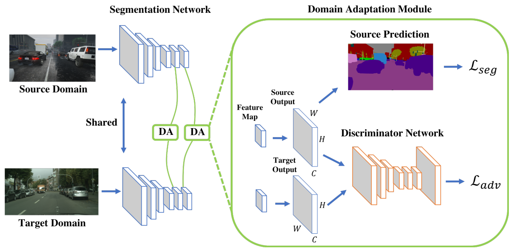
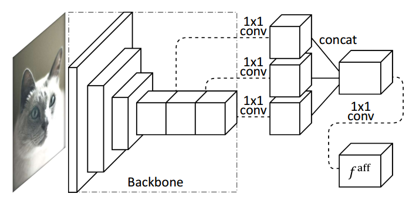
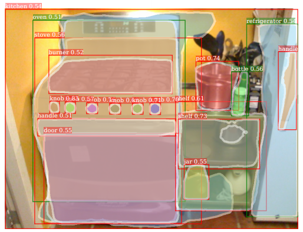
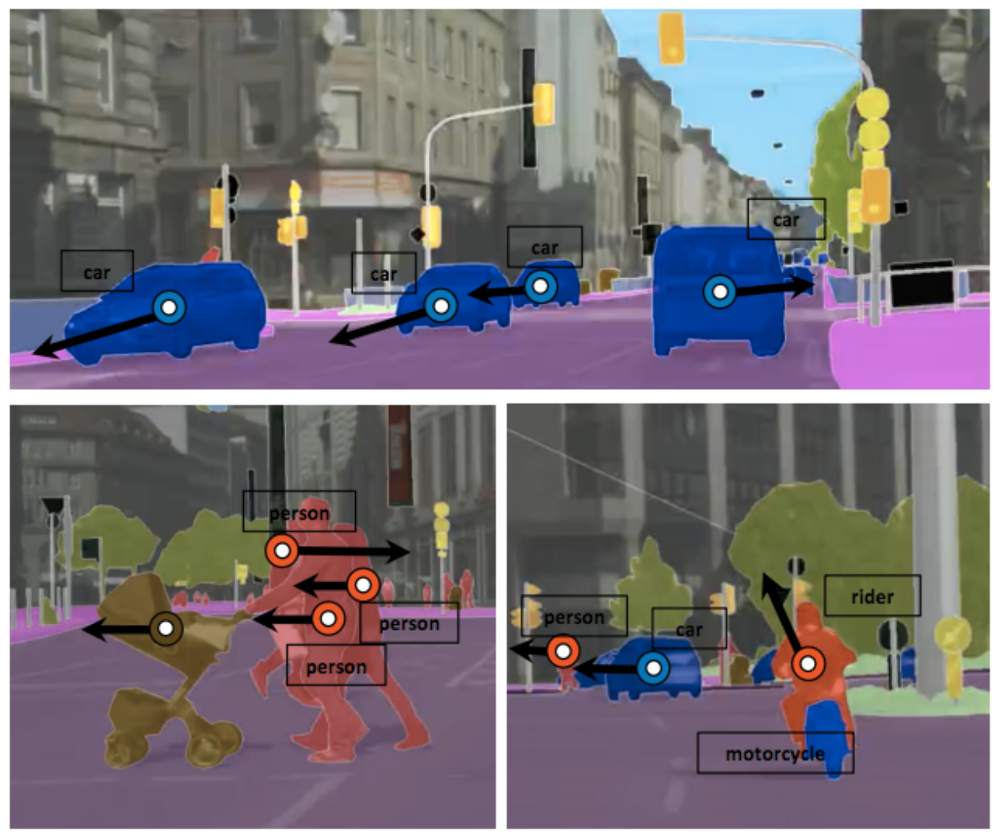
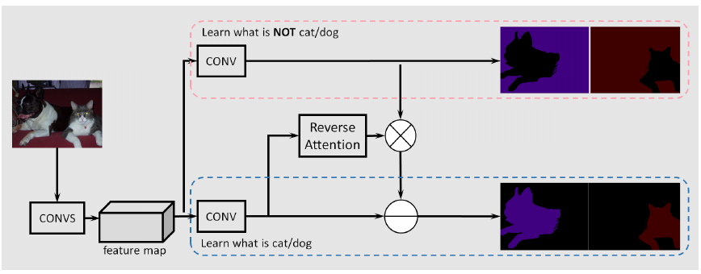
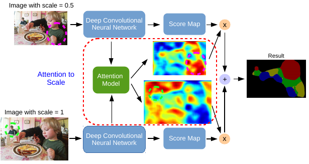

## Semantic Segmentation and Scene Parsing
### 2018
|No.   |Figure   |Title   |Authors  |Pub.  |Links|
|-----|:-----:|:-----:|:-----:|:-----:|:---:|
|4||__Multi-Evidence Filtering and Fusion for Multi-Label Classification, Object Detection and Semantic Segmentation Based on Weakly Supervised Learning__|Weifeng Ge, Sibei Yang, Yizhou Yu|__CVPR 2018__|[`paper`](https://arxiv.org/abs/1802.09129v1)|
|3||__Learning to Adapt Structured Output Space for Semantic Segmentation__|Yi-Hsuan Tsai, Wei-Chih Hung, Samuel Schulter, Kihyuk Sohn, Ming-Hsuan Yang, Manmohan Chandraker|__CVPR 2018__|[`paper`](https://arxiv.org/abs/1802.10349v1) [`github`](https://github.com/wasidennis/AdaptSegNet)|
|2||__Learning Pixel-level Semantic Affinity with Image-level Supervision for Weakly Supervised Semantic Segmentation__|Jiwoon Ahn, Suha Kwak|__CVPR 2018__|[`paper`](https://arxiv.org/abs/1803.10464v1)|
|1||__Learning to Segment Every Thing__|Ronghang Hu, Piotr Dollar, Kaiming He, Trevor Darrell, Ross Girshick|__CVPR 2018__|[`paper`](https://arxiv.org/abs/1711.10370)|

### 2017
|No.   |Figure   |Title   |Authors  |Pub.  |Links|
|-----|:-----:|:-----:|:-----:|:-----:|:---:|
|9||__Predicting Deeper into the Future of Semantic Segmentation__|Pauline Luc, Natalia Neverova, Camille Couprie, Jakob Verbeek and Yann LeCun|__ICCV 2017__|[`paper`](https://arxiv.org/abs/1703.07684) [`project page`](https://thoth.inrialpes.fr/people/pluc/iccv2017)|
|8||__Semantic Segmentation with Reverse Attention__|Qin Huang, Chunyang Xia, Wuchi Hao, Siyang Li, Ye Wang, Yuhang Song and C.-C. Jay Kuo|__BMVC 2017__|[`paper`](https://arxiv.org/abs/1707.06426) [`code`](https://drive.google.com/drive/folders/0By2w_AaM8Rzbllnc3JCQjhHYnM?usp=sharing)|
|7||__Not All Pixels Are Equal: Difficulty-Aware Semantic Segmentation via Deep Layer Cascade__|Xiaoxiao Li, Ziwei Liu, Ping Luo, Chen Change Loy, Xiaoou Tang|__CVPR 2017__|[`paper`](https://arxiv.org/abs/1704.01344)|
|6||__Object Region Mining with Adversarial Erasing: A Simple Classification toSemantic Segmentation Approach__|Yunchao Wei, Jiashi Feng, Xiaodan Liang, Ming-Ming Cheng, Yao Zhao, Shuicheng Yan|__CVPR 2017__|[`paper`](https://arxiv.org/abs/1703.08448) :star:|
|5||__Full-Resolution Residual Networks for Semantic Segmentation in Street Scenes__|Tobias Pohlen, Alexander Hermans, Markus Mathias, Bastian Leibe|__CVPR 2017__|[`paper`](https://arxiv.org/abs/1611.08323) [`github`](https://github.com/TobyPDE/FRRN)|
|4||__Fully Convolutional Instance-aware Semantic Segmentation__|Yi Li, Haozhi Qi, Jifeng Dai, Xiangyang Ji, Yichen Wei|__CVPR 2017__|[`paper`](https://arxiv.org/abs/1611.07709) [`github`](https://github.com/msracver/FCIS)|
|3||__Dilated Residual Networks__|Fisher Yu, Vladlen Koltun, Thomas Funkhouser|__CVPR 2017__|[`paper`](https://arxiv.org/abs/1705.09914) [`github`](https://github.com/fyu/drn)|
|2||__Pyramid Scene Parsing Network__|Hengshuang Zhao, Jianping Shi, Xiaojuan Qi, Xiaogang Wang, Jiaya Jia|__CVPR 2017__|[`paper`](https://arxiv.org/abs/1612.01105)  [`github`](https://github.com/hszhao/PSPNet)|
|1||__RefineNet: Multi-Path Refinement Networks for High-Resolution Semantic Segmentation__|Guosheng Lin, Anton Milan, Chunhua Shen, Ian Reid|__CVPR 2017__|[`paper`](https://arxiv.org/abs/1611.06612)  [`github`](https://github.com/guosheng/refinenet)|

### 2016
|No.   |Figure   |Title   |Authors  |Pub.  |Links|
|-----|:-----:|:-----:|:-----:|:-----:|:---:|
|3||__Attention to Scale: Scale-aware Semantic Image Segmentation__|Liang-Chieh Chen, Yi Yang, Jiang Wang, Wei Xu|__CVPR 2016__|[`paper`](http://www.cv-foundation.org/openaccess/content_cvpr_2016/html/Chen_Attention_to_Scale_CVPR_2016_paper.html) [`DeepLab`](http://liangchiehchen.com/projects/DeepLab.html) :star:|
|2||__Laplacian Pyramid Reconstruction and Refinement for Semantic Segmentation__|Golnaz Ghiasi, Charless C. Fowlkes|__ECCV 2016__|[`paper`](https://link.springer.com/chapter/10.1007/978-3-319-46487-9_32)  [`github`](https://github.com/golnazghiasi/LRR)|
|1||__Instance-sensitive Fully Convolutional Networks__|Jifeng Dai, Kaiming He, Yi Li, Shaoqing Ren, Jian Sun|__ECCV 2016__|[`paper`](https://arxiv.org/abs/1603.08678)|

### 2015
|No.   |Figure   |Title   |Authors  |Pub.  |Links|
|-----|:-----:|:-----:|:-----:|:-----:|:---:|
|5||__Learning Deconvolution Network for Semantic Segmentation__|Heonwoo Noh, Seunghoon Hong, Bohyung Han|__ICCV 2015__|[`paper`](http://www.cv-foundation.org/openaccess/content_iccv_2015/html/Noh_Learning_Deconvolution_Network_ICCV_2015_paper.html)|
|4||__Conditional Random Fields as Recurrent Neural Networks__|Shuai Zheng, Sadeep Jayasumana, Bernardino Romera-Paredes, Vibhav Vineet, ZhiZhong Su, Dalong Du, Chang Huang, and Philip H. S. Torr|__ICCV 2015__|[`paper`](http://www.cv-foundation.org/openaccess/content_iccv_2015/html/Zheng_Conditional_Random_Fields_ICCV_2015_paper.html)|
|3||__Learning to Refine Object Segments__|Pedro O. Pinheiro , Tsung-Yi Lin , Ronan Collobert, Piotr Doll ́ar|__arXiv 1603.08695__|[`paper`](https://arxiv.org/pdf/1603.08695.pdf)|
|2||__Learning to Segment Object Candidates__|Pedro O. Pinheiro, Ronan Collobert, Piotr Dollar|__NIPS 2015__|[`paper`](http://papers.nips.cc/paper/5852-learning-to-segment-object-candidates.pdf)|
|1||__Fully Convolutional Networks for Semantic Segmentation__|Jonathan Long, Evan Shelhamer, Trevor Darrell|__CVPR 2015__|[`paper`](https://people.eecs.berkeley.edu/~jonlong/long_shelhamer_fcn.pdf) :star:|