# Instance Aware Paper List
- The goal of this document is to provide a reading list for papers related to "Instance".

## Papers
Paper list.

|No.|Figure   |Title   |Authors  |Pub.  |Links|
|:-----:|:-----:|:-----:|:-----:|:---:|:------:|
|1||__Instance-aware Semantic Segmentation via Multi-task Network Cascades__|Jifeng Dai, [Kaiming He](http://kaiminghe.com/), Jian Sun|__CVPR 2016__|[`paper`](http://www.cv-foundation.org/openaccess/content_cvpr_2016/papers/Dai_Instance-Aware_Semantic_Segmentation_CVPR_2016_paper.pdf) [`github`](https://github.com/daijifeng001/MNC) :star:|
|2|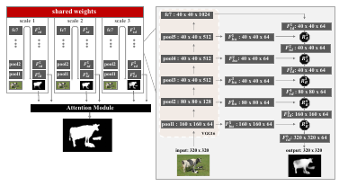|__Instance-Level Salient Object Segmentation__|[Guanbin Li](https://sites.google.com/site/ligb86/), Yuan Xie, Liang Lin, Yizhou Yu|__CVPR 2017__|[`paper`](https://arxiv.org/pdf/1704.03604.pdf)|
|3|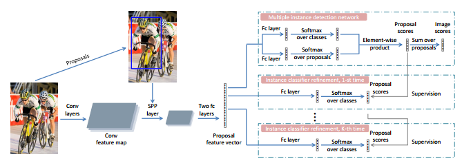|__Multiple Instance Detection Network with Online Instance Classifier Refinement__|Peng Tang, Xinggang Wang, Xiang Bai, Wenyu Liu|__CVPR 2017__|[`paper`](https://arxiv.org/abs/1704.00138)|
|4|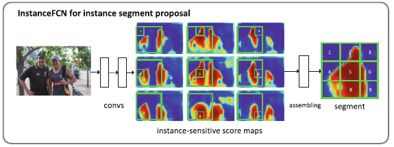|__Instance-sensitive Fully Convolutional Networks__|Jifeng Dai, Kaiming He, Yi Li, Shaoqing Ren, Jian Sun|__ECCV 2016__|[`paper`](https://arxiv.org/abs/1603.08678)|
|5||__Fully Convolutional Instance-aware Semantic Segmentation__|Yi Li, Haozhi Qi, Jifeng Dai, Xiangyang Ji, Yichen Wei|__CVPR 2017__|[`paper`](https://arxiv.org/abs/1611.07709) [`github`](https://github.com/msracver/FCIS)|
|6|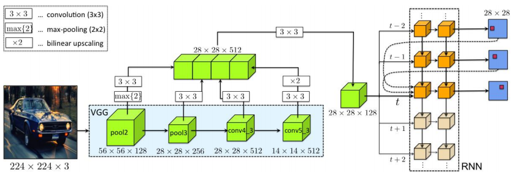|__Annotating Object Instances with a Polygon-RNN__|Lluis Castrejon, Kaustav Kundu, Raquel Urtasun, Sanja Fidler|__CVPR 2017__|[`paper`](https://arxiv.org/abs/1704.05548) :star:|
|7|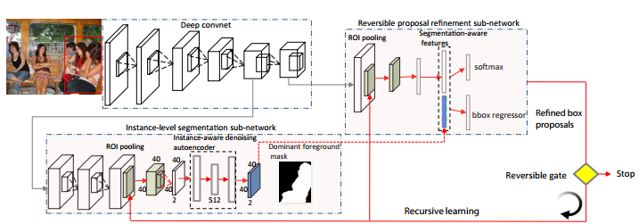|__Reversible Recursive Instance-Level Object Segmentation__|Xiaodan Liang, Yunchao Wei, Xiaohui Shen, Zequn Jie, Jiashi Feng, Liang Lin, Shuicheng Yan|__CVPR 2016__|[`paper`](http://www.cv-foundation.org/openaccess/content_cvpr_2016/html/Liang_Reversible_Recursive_Instance-Level_CVPR_2016_paper.html)|
|8|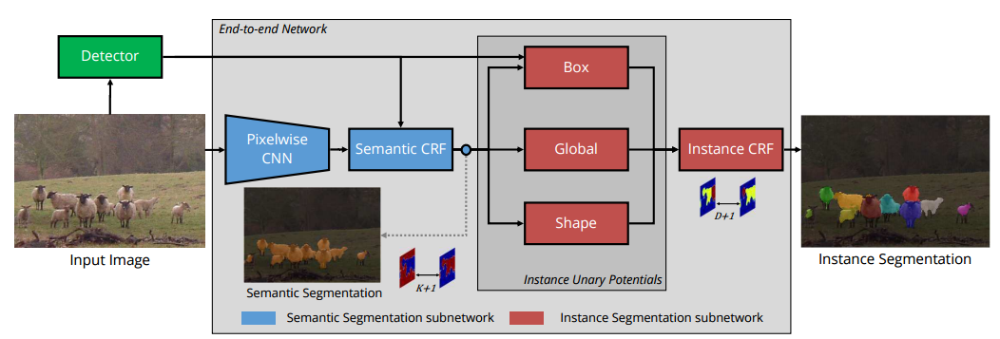|__Pixelwise Instance Segmentation With a Dynamically Instantiated Network__|Anurag Arnab, Philip H. S. Torr|__CVPR 2017__|[`paper`](http://openaccess.thecvf.com/content_cvpr_2017/papers/Arnab_Pixelwise_Instance_Segmentation_CVPR_2017_paper.pdf)|
|9|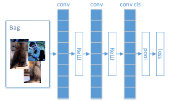|__MIML-FCN+: Multi-instance Multi-label Learning via Fully Convolutional Networks with Privileged Information__|Hao Yang, Joey Tianyi Zhou, Jianfei Cai, Yew Soon Ong|__CVPR 2017__|[`paper`](http://openaccess.thecvf.com/content_cvpr_2017/papers/Yang_MIML-FCN_Multi-Instance_Multi-Label_CVPR_2017_paper.pdf)|
|10|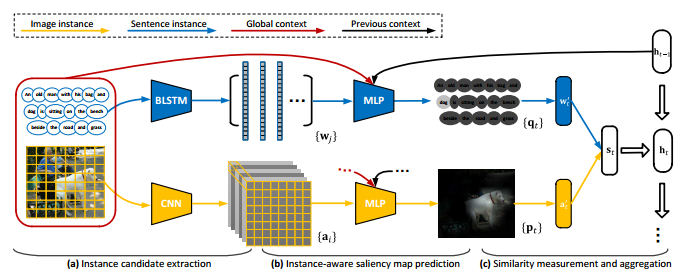|__Instance-Aware Image and Sentence Matching With Selective Multimodal LSTM__|Yan Huang, Wei Wang, Liang Wang|__CVPR 2017__|[`paper`](http://openaccess.thecvf.com/content_cvpr_2017/papers/Huang_Instance-Aware_Image_and_CVPR_2017_paper.pdf)|
|11|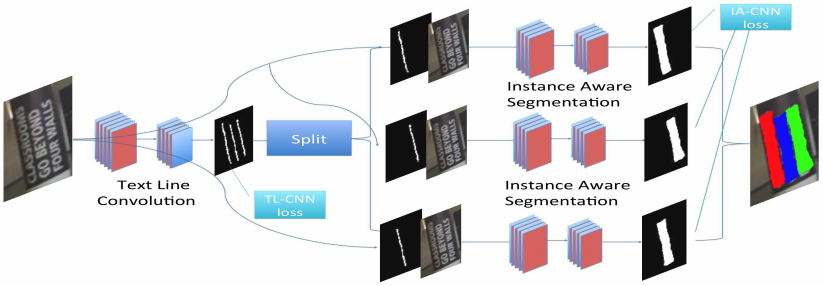|__Multi-Scale FCN With Cascaded Instance Aware Segmentation for Arbitrary Oriented Word Spotting in the Wild__|Dafang He, Xiao Yang, Chen Liang, Zihan Zhou, Alexander G. Ororbi II, Daniel Kifer, C. Lee Giles|__CVPR 2017__|[`paper`](http://openaccess.thecvf.com/content_cvpr_2017/papers/He_Multi-Scale_FCN_With_CVPR_2017_paper.pdf)|
|12|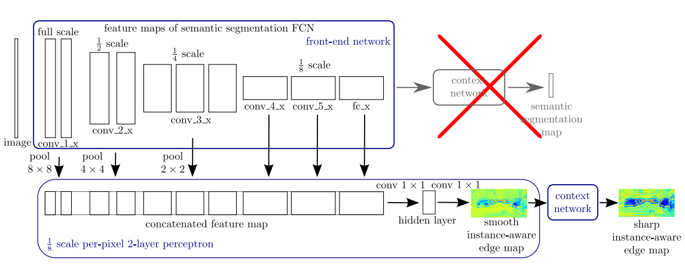|__InstanceCut: From Edges to Instances With MultiCut__|Alexander Kirillov, Evgeny Levinkov, Bjoern Andres, Bogdan Savchynskyy, Carsten Rother|__CVPR 2017__|[`paper`](http://openaccess.thecvf.com/content_cvpr_2017/papers/Kirillov_InstanceCut_From_Edges_CVPR_2017_paper.pdf)|
|13|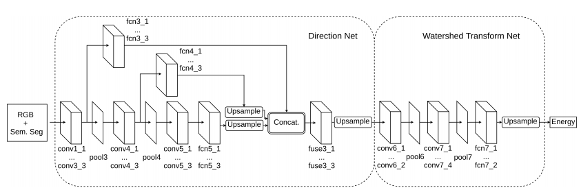|__Deep Watershed Transform for Instance Segmentation__|Min Bai, Raquel Urtasun|__CVPR 2017__|[`paper`](http://openaccess.thecvf.com/content_cvpr_2017/papers/Bai_Deep_Watershed_Transform_CVPR_2017_paper.pdf) [`github`](https://github.com/min2209/dwt)|
|14|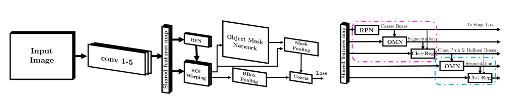|__Boundary-Aware Instance Segmentation__|Zeeshan Hayder, Xuming He, Mathieu Salzmann|__CVPR 2017__|[`paper`](http://openaccess.thecvf.com/content_cvpr_2017/papers/Hayder_Boundary-Aware_Instance_Segmentation_CVPR_2017_paper.pdf)|
|15|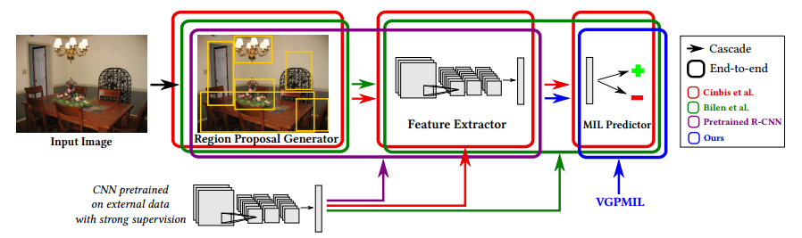|__Variational Bayesian Multiple Instance Learning With Gaussian Processes__|Manuel Haussmann, Fred A. Hamprecht, Melih Kandemir|__CVPR 2017__|[`paper`](http://openaccess.thecvf.com/content_cvpr_2017/papers/Haussmann_Variational_Bayesian_Multiple_CVPR_2017_paper.pdf) [`github`](https://github.com/manuelhaussmann/vgpmil)|
|16|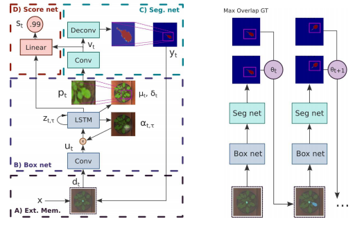|__End-To-End Instance Segmentation With Recurrent Attention__|Mengye Ren, Richard S. Zemel|__CVPR 2017__|[`paper`](http://openaccess.thecvf.com/content_cvpr_2017/papers/Ren_End-To-End_Instance_Segmentation_CVPR_2017_paper.pdf)|