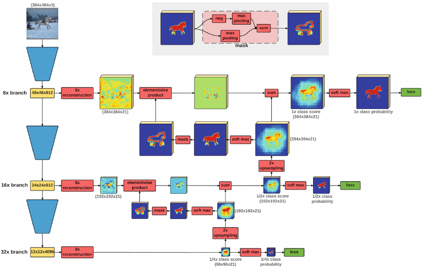
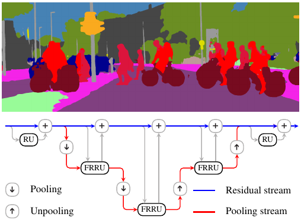
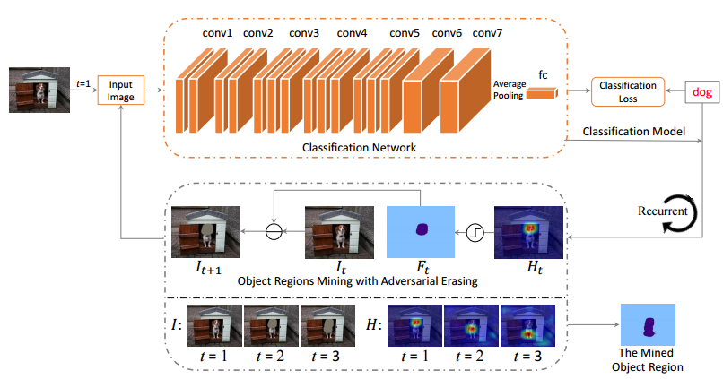
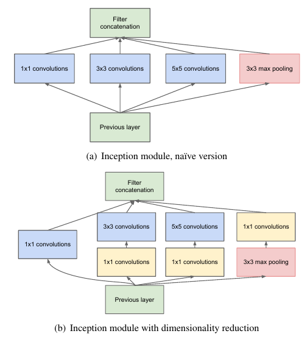
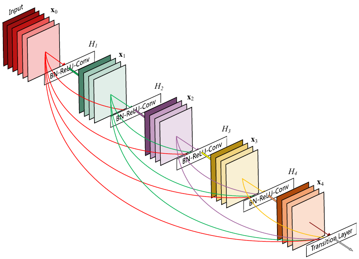
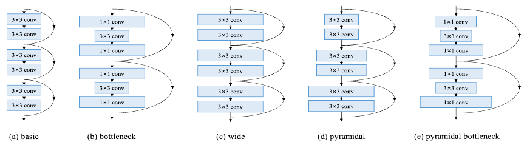

# Recommended Papers
- The goal of this document is to provide a reading list for Deep Learning in Computer Vision Field.
## Topics
- [Salient Object Detection](#salient-object-detection)
- [Visual Object Tracking](#visual-object-tracking)
- [Object Detection](#object-detection)
- [Object Localization](#object-localization)
- [Semantic Segmentation and Scene Parsing](#semantic-segmentation-and-scene-parsing)
- [Edge Detection](#edge-detection)
- [Pose Estimation](#pose-estimation)
- [Super Resolution](#super-resolution)
- [Image Classification](#image-classification)
- [Others](#others)
## Papers
Paper list.
### Salient Object Detection
|Figure   |Title   |Authors  |Pub.  |Links|
|:-----:|:-----:|:-----:|:-----:|:---:|
||__Visual Saliency Based on Multiscale Deep Features__|[Guanbin Li](https://sites.google.com/site/ligb86/), Yizhou Yu|__CVPR 2015__|[`project page`](https://sites.google.com/site/ligb86/mdfsaliency/)|
||__Saliency Detection by Multi-context Deep Learning__|[Rui Zhao](http://www.ee.cuhk.edu.hk/~rzhao/), Wanli Ouyang, Hongsheng Li, Xiaogang Wang|__CVPR 2015__|[`paper`](http://www.ee.cuhk.edu.hk/~rzhao/project/deepsal_cvpr15/zhaoOLWcvpr15.pdf) [`code`](https://github.com/Robert0812/deepsaldet)|
||__Deep Networks for Saliency Detection via Local Estimation and Global Search__|Lijun Wang, Huchuan Lu, Xiang Ruan, Ming-Hsuan Yang|__CVPR 2015__|[`paper`](http://www.cv-foundation.org/openaccess/content_cvpr_2015/papers/Wang_Deep_Networks_for_2015_CVPR_paper.pdf) [`code`](https://drive.google.com/file/d/0B5rfGpkt3dDaVmhucE1jTVZGeTA/view)|
||__DHSNet: Deep Hierarchical Saliency Network for Salient Object Detection__|[Nian Liu](https://sites.google.com/site/liunian228/), Junwei Han|__CVPR 2016__|[`paper`](http://www.cv-foundation.org/openaccess/content_cvpr_2016/papers/Liu_DHSNet_Deep_Hierarchical_CVPR_2016_paper.pdf) [`code`](https://drive.google.com/file/d/0B1sbejbIJIW3RlJJY1NNNkFydEU/view) :star:|
||__Deep Contrast Learning for Salient Object Detection__|[Guanbin Li](https://sites.google.com/site/ligb86/), Yizhou Yu|__CVPR 2016__|[`project page`](http://i.cs.hku.hk/~gbli/deep_saliency.html)|
||__Saliency Unified: A Deep Architecture for Simultaneous Eye Fixation Prediction and Salient Object Segmentation__|Srinivas S S Kruthiventi, Vennela Gudisa, Jaley H Dholakiya and R. Venkatesh Babu|__CVPR 2016__|[`project page`](http://val.serc.iisc.ernet.in/saliency-unified/)|
||__Deep Saliency with Encoded Low level Distance Map and High Level Features__|Gayoung Lee, Yu-Wing Tai, Junmo Kim|__CVPR 2016__|[`paper`](http://www.cv-foundation.org/openaccess/content_cvpr_2016/papers/Lee_Deep_Saliency_With_CVPR_2016_paper.pdf) [`code`](https://github.com/gylee1103/SaliencyELD)|
||__Recurrent Attentional Networks for Saliency Detection__|Jason Kuen, Zhenhua Wang, Gang Wang|__CVPR 2016__|[`paper`](http://www.cv-foundation.org/openaccess/content_cvpr_2016/papers/Kuen_Recurrent_Attentional_Networks_CVPR_2016_paper.pdf)|
||__DeepSaliency: Multi-Task Deep Neural Network Model for Salient Object Detection__|Xi Li, Liming Zhao, Lina Wei, Ming-Hsuan Yang, Fei Wu, Yueting Zhuang, Haibin Ling, Jingdong Wang|__TIP 2016__|[`project page`](http://www.zhaoliming.net/research/deepsaliency)|
||__A Shape-Based Approach for Salient Object Detection Using Deep Learning__|[Jongpil Kim](http://www.research.cs.rutgers.edu/~jpkim/), Vladimir Pavlovic|__ECCV 2016__|[`paper`](http://www.research.cs.rutgers.edu/~jpkim/papers/jpkim_eccv2016.pdf) [`Pre-computed Maps`](http://www.research.cs.rutgers.edu/~jpkim/papers/resources/ssd_hs.tar.gz)|
||__Saliency Detection with Recurrent Fully Convolutional Networks__|Linzhao Wang, Lijun Wang, Huchuan Lu, Pingping Zhang, Xiang Ruan|__ECCV 2016__|[`paper`](https://www.researchgate.net/profile/Pingping_Zhang6/publication/308278832_Saliency_Detection_with_Recurrent_Fully_Convolutional_Networks/links/584b5da208aecb6bd8c157e0/Saliency-Detection-with-Recurrent-Fully-Convolutional-Networks.pdf) [`code`](https://drive.google.com/file/d/0B5rfGpkt3dDaODFRZ0ZXZjQyWDg/view)|
||__Deeply Supervised Salient Object Detection with Short Connections__|Qibin Hou, [Ming-Ming Cheng](http://mmcheng.net/cmm/), Xiaowei Hu, Ali Borji, [Zhuowen Tu](http://pages.ucsd.edu/~ztu/), Philip Torr|__CVPR 2017__|[`paper`](https://arxiv.org/abs/1611.04849) [`github`](https://github.com/Andrew-Qibin/DSS) :star:|
||__Non-Local Deep Features for Salient Object Detection__|Zhiming Luo, Akshaya Mishra , Andrew Achkar , Justin Eichel , Shaozi Li , Pierre-Marc.Jodoin|__CVPR 2017__|[`project page`](https://sites.google.com/view/zhimingluo/nldf)|
||__Instance-Level Salient Object Segmentation__|[Guanbin Li](https://sites.google.com/site/ligb86/), Yuan Xie, Liang Lin, Yizhou Yu|__CVPR 2017__|[`paper`](https://arxiv.org/pdf/1704.03604.pdf)|
||__Learning to Detect Salient Objects with Image-level Supervision__|Lijun Wang, Huchuan Lu, Yifan Wang, Mengyang Feng, Dong Wang, Baocai Yin , Xiang Ruan|__CVPR 2017__|[`paper`](http://saliencydetection.net/duts/download/camera_ready.pdf) [`github`](https://github.com/scott89/WSS)|

### Visual Object Tracking
[Recommended Homepage---OTB Results. This shares results for more recent trackers.](https://github.com/foolwood/benchmark_results)

### Object Detection
|Figure   |Title   |Authors  |Pub.  |Links|
|:-----:|:-----:|:-----:|:-----:|:---:|
||__Rich feature hierarchies for accurate object detection and semantic segmentation__|Ross Girshick, Jeff Donahue, Trevor Darrell, Jitendra Malik|__CVPR 2014__|[`paper`](http://www.cv-foundation.org/openaccess/content_cvpr_2014/papers/Girshick_Rich_Feature_Hierarchies_2014_CVPR_paper.pdf) [`github`](https://github.com/rbgirshick/rcnn) :star:|
||__Fast R-CNN__|Ross Girshick|__ICCV 2015__|[`paper`](http://www.cv-foundation.org/openaccess/content_iccv_2015/papers/Girshick_Fast_R-CNN_ICCV_2015_paper.pdf) [`github`](https://github.com/rbgirshick/fast-rcnn) :star:|
||__Faster R-CNN: Towards Real-Time Object Detection with Region Proposal Networks__|Shaoqing Ren, [Kaiming He](http://kaiminghe.com/), Ross Girshick, Jian Sun|__NIPS 2015__|[`paper`](http://papers.nips.cc/paper/5638-faster-r-cnn-towards-real-time-object-detection-with-region-proposal-networks.pdf) [`matlab`](https://github.com/ShaoqingRen/faster_rcnn) [`python`](https://github.com/rbgirshick/py-faster-rcnn) :star:|
||__Convolutional Feature Masking for Joint Object and Stuff Segmentation__|Jifeng Dai, [Kaiming He](http://kaiminghe.com/), Jian Sun|__CVPR 2015__|[`paper`](http://www.cv-foundation.org/openaccess/content_cvpr_2015/papers/Dai_Convolutional_Feature_Masking_2015_CVPR_paper.pdf)|
||__Instance-aware Semantic Segmentation via Multi-task Network Cascades__|Jifeng Dai, [Kaiming He](http://kaiminghe.com/), Jian Sun|__CVPR 2016__|[`paper`](http://www.cv-foundation.org/openaccess/content_cvpr_2016/papers/Dai_Instance-Aware_Semantic_Segmentation_CVPR_2016_paper.pdf) [`github`](https://github.com/daijifeng001/MNC) :star:|
||__R-FCN: Object Detection via Region-based Fully Convolutional Networks__|Jifeng Dai, Yi Li, [Kaiming He](http://kaiminghe.com/), Jian Sun|__NIPS 2016__|[`paper`](https://arxiv.org/abs/1605.06409) [`github`](https://github.com/daijifeng001/R-FCN)|
||__Feature Pyramid Networks for Object Detection__|Tsung-Yi Lin, Piotr Dollár, Ross Girshick, [Kaiming He](http://kaiminghe.com/), Bharath Hariharan, and Serge Belongie|__CVPR 2017__|[`paper`](https://arxiv.org/pdf/1612.03144.pdf)|
||__Mask R-CNN__|Kaiming He, Georgia Gkioxari, Piotr Dollár, Ross Girshick|__Tech Report__|[`paper`](https://arxiv.org/abs/1703.06870) :star:|
||__A-Fast-RCNN: Hard Positive Generation via Adversary for Object Detection__|Xiaolong Wang, Abhinav Shrivastava, Abhinav Gupta|__CVPR 2017__|[`paper`](https://arxiv.org/abs/1704.03414)  [`github`](https://github.com/xiaolonw/adversarial-frcnn) :star:|
||__Multiple Instance Detection Network with Online Instance Classifier Refinement__|Peng Tang, Xinggang Wang, Xiang Bai, Wenyu Liu|__CVPR 2017__|[`paper`](https://arxiv.org/abs/1704.00138)|

### Object Localization
|Figure   |Title   |Authors  |Pub.  |Links|
|:-----:|:-----:|:-----:|:-----:|:---:|
||__Simultaneous Detection and Segmentation__|Bharath Hariharan, Pablo Arbeláez, Ross Girshick, Jitendra Malik|__ECCV 2014__|[`paper`](https://arxiv.org/abs/1407.1808) :star:|
||__Deep Self-Taught Learning for Weakly Supervised Object Localization__|Zequn Jie, Yunchao Wei, Xiaojie Jin, Jiashi Feng, Wei Liu|__CVPR 2017__|[`paper`](https://arxiv.org/abs/1704.05188)|
||__Learning Detection with Diverse Proposals__|Samaneh Azadi, Jiashi Feng, Trevor Darrell|__CVPR 2017__|[`paper`](https://arxiv.org/abs/1704.03533)|

### Semantic Segmentation and Scene Parsing
|Figure   |Title   |Authors  |Pub.  |Links|
|:-----:|:-----:|:-----:|:-----:|:---:|
||__Fully Convolutional Networks for Semantic Segmentation__|Jonathan Long, Evan Shelhamer, Trevor Darrell|__CVPR 2015__|[`paper`](https://people.eecs.berkeley.edu/~jonlong/long_shelhamer_fcn.pdf) :star:|
||__Learning to Segment Object Candidates__|Pedro O. Pinheiro, Ronan Collobert, Piotr Dollar|__NIPS 2015__|[`paper`](http://papers.nips.cc/paper/5852-learning-to-segment-object-candidates.pdf)|
||__Learning to Refine Object Segments__|Pedro O. Pinheiro , Tsung-Yi Lin , Ronan Collobert, Piotr Doll ́ar|__arXiv 1603.08695__|[`paper`](https://arxiv.org/pdf/1603.08695.pdf)|
||__Conditional Random Fields as Recurrent Neural Networks__|Shuai Zheng, Sadeep Jayasumana, Bernardino Romera-Paredes, Vibhav Vineet, ZhiZhong Su, Dalong Du, Chang Huang, and Philip H. S. Torr|__ICCV 2015__|[`paper`](http://www.cv-foundation.org/openaccess/content_iccv_2015/html/Zheng_Conditional_Random_Fields_ICCV_2015_paper.html)|
||__Learning Deconvolution Network for Semantic Segmentation__|Heonwoo Noh, Seunghoon Hong, Bohyung Han|__ICCV 2015__|[`paper`](http://www.cv-foundation.org/openaccess/content_iccv_2015/html/Noh_Learning_Deconvolution_Network_ICCV_2015_paper.html)|
||__Instance-sensitive Fully Convolutional Networks__|Jifeng Dai, Kaiming He, Yi Li, Shaoqing Ren, Jian Sun|__arXiv 1603.08678__|[`paper`](https://arxiv.org/abs/1603.08678)|
||__Laplacian Pyramid Reconstruction and Refinement for Semantic Segmentation__|Golnaz Ghiasi, Charless C. Fowlkes|__ECCV 2016__|[`paper`](https://link.springer.com/chapter/10.1007/978-3-319-46487-9_32)  [`github`](https://github.com/golnazghiasi/LRR)|
||__Attention to Scale: Scale-aware Semantic Image Segmentation__|Liang-Chieh Chen, Yi Yang, Jiang Wang, Wei Xu, Alan L. Yuille|__CVPR 2016__|[`paper`](http://www.cv-foundation.org/openaccess/content_cvpr_2016/html/Chen_Attention_to_Scale_CVPR_2016_paper.html)|
||__Not All Pixels Are Equal: Difficulty-Aware Semantic Segmentation via Deep Layer Cascade__|Xiaoxiao Li, Ziwei Liu, Ping Luo, Chen Change Loy, Xiaoou Tang|__CVPR 2016__|[`paper`](https://arxiv.org/abs/1704.01344)|
||__RefineNet: Multi-Path Refinement Networks for High-Resolution Semantic Segmentation__|Guosheng Lin, Anton Milan, Chunhua Shen, Ian Reid|__CVPR 2017__|[`paper`](https://arxiv.org/abs/1611.06612)  [`github`](https://github.com/guosheng/refinenet)|
||__Pyramid Scene Parsing Network__|Hengshuang Zhao, Jianping Shi, Xiaojuan Qi, Xiaogang Wang, Jiaya Jia|__CVPR 2017__|[`paper`](https://arxiv.org/abs/1612.01105)  [`github`](https://github.com/hszhao/PSPNet)|
||__Dilated Residual Networks__|Fisher Yu, Vladlen Koltun, Thomas Funkhouser|__CVPR 2017__|[`paper`](https://arxiv.org/abs/1705.09914)|
||__Fully Convolutional Instance-aware Semantic Segmentation__|Yi Li, Haozhi Qi, Jifeng Dai, Xiangyang Ji, Yichen Wei|__CVPR 2017__|[`paper`](https://arxiv.org/abs/1611.07709) [`github`](https://github.com/msracver/FCIS)|
|__Full-Resolution Residual Networks for Semantic Segmentation in Street Scenes__|Tobias Pohlen, Alexander Hermans, Markus Mathias, Bastian Leibe|__CVPR 2017__|[`paper`](https://arxiv.org/abs/1611.08323)|
|__Object Region Mining with Adversarial Erasing: A Simple Classification toSemantic Segmentation Approach__|Yunchao Wei, Jiashi Feng, Xiaodan Liang, Ming-Ming Cheng, Yao Zhao, Shuicheng Yan|__CVPR 2017__|[`paper`](https://arxiv.org/abs/1703.08448) :star:|

### Edge Detection
|Figure   |Title   |Authors  |Pub.  |Links|
|:-----:|:-----:|:-----:|:-----:|:---:|
||__Holistically-Nested Edge Detection__|Saining Xie, Zhuowen Tu|__ICCV 2015__|[`paper`](http://www.cv-foundation.org/openaccess/content_iccv_2015/papers/Xie_Holistically-Nested_Edge_Detection_ICCV_2015_paper.pdf) [`github`](https://github.com/s9xie/hed) :star:|
||__Richer Convolutional Features for Edge Detection__|Yun Liu, Ming-Ming Cheng, Xiaowei Hu, Kai Wang, Xiang Bai|__CVPR 2017__|[`paper`](https://arxiv.org/abs/1612.02103)|
||__CASENet: Deep Category-Aware Semantic Edge Detection__|Zhiding Yu, Chen Feng, Ming-Yu Liu, Srikumar Ramalingam|__CVPR 2017__|[`paper`](https://arxiv.org/abs/1705.09759)|

### Pose Estimation
|Figure   |Title   |Authors  |Pub.  |Links|
|:-----:|:-----:|:-----:|:-----:|:---:|
||__Stacked Hourglass Networks for Human Pose Estimation__|Alejandro Newell, Kaiyu Yang, and Jia Deng|__ECCV 2016__|[`paper`](https://arxiv.org/abs/1603.06937) :star:|
||__Multi-Context Attention for Human Pose Estimation__|[Xiao Chu](http://www.ee.cuhk.edu.hk/~xchu/), Wei Yang, [Wanli Ouyang](http://www.ee.cuhk.edu.hk/~wlouyang/), Cheng Ma, Alan L. Yuille, [Xiaogang Wang](http://www.ee.cuhk.edu.hk/~xgwang/)|__CVPR 2017__|[`paper`](https://arxiv.org/abs/1702.07432) [`github`](https://github.com/bearpaw/pose-attention)|

### Super Resolution
|Figure   |Title   |Authors  |Pub.  |Links|
|:-----:|:-----:|:-----:|:-----:|:---:|
||__Deep Laplacian Pyramid Networks for Fast and Accurate Super-Resolution__|Wei-Sheng Lai, Jia-Bin Huang, Narendra Ahuja, Ming-Hsuan Yang|__CVPR 2017__|[`project page`](http://vllab1.ucmerced.edu/~wlai24/LapSRN/)|
||__Image Super-Resolution via Deep Recursive Residual Network__|Ying Tai, Jian Yang, and Xiaoming Liu|__CVPR 2017__|[`paper`](https://www.researchgate.net/profile/Xiaoming_Liu8/publication/316017318_Image_Super-Resolution_via_Deep_Recursive_Residual_Network/links/58eda40b0f7e9b37ed14f5d7/Image-Super-Resolution-via-Deep-Recursive-Residual-Network.pdf) [`github`](https://github.com/tyshiwo/DRRN_CVPR17)|

### Image Classification
|Figure   |Title   |Authors  |Pub.  |Links|
|:-----:|:-----:|:-----:|:-----:|:---:|
||__Deep Residual Learning for Image Recognition__|Kaiming He, Xiangyu Zhang, Shaoqing Ren, and Jian Sun|__CVPR 2015__ *`best`*|[`paper`](https://arxiv.org/abs/1512.03385) [`github`](https://github.com/KaimingHe/deep-residual-networks) :star:|
||__Going Deeper with Convolutions__|Christian Szegedy, Wei Liu, Yangqing Jia, Pierre Sermanet, Scott Reed|__CVPR 2015__|[`paper`](http://www.cv-foundation.org/openaccess/content_cvpr_2015/html/Szegedy_Going_Deeper_With_2015_CVPR_paper.html) :star:|
||__Residual Attention Network for Image Classification__|Fei Wang, Mengqing Jiang, Chen Qian, Shuo Yang, Cheng Li, Honggang Zhang, Xiaogang Wang, Xiaoou Tang|__CVPR 2017__|[`paper`](https://arxiv.org/abs/1704.06904) [`github`](https://github.com/buptwangfei/residual-attention-network) :star:|
||__Aggregated Residual Transformations for Deep Neural Networks__|Saining Xie, Ross Girshick, Piotr Dollár, Zhuowen Tu, and Kaiming He|__CVPR 2017__|[`paper`](https://arxiv.org/abs/1611.05431) [`github`](https://github.com/facebookresearch/ResNeXt)|
||__Densely Connected Convolutional Networks__|Gao Huang, Zhuang Liu, Kilian Q. Weinberger|__CVPR 2017__ *`best`*|[`paper`](https://arxiv.org/abs/1608.06993) [`github`](https://github.com/liuzhuang13/DenseNet) :star:|
||__Deep Pyramidal Residual Networks__|Dongyoon Han, Jiwhan Kim, Junmo Kim|__CVPR 2017__|[`paper`](https://arxiv.org/pdf/1610.02915.pdf) [`github`](https://github.com/jhkim89/PyramidNet) :star:|

### Others
|Figure   |Title   |Authors  |Pub.  |Links|
|:-----:|:-----:|:-----:|:-----:|:---:|
||__Object Skeleton Extraction in Natural Images by Fusing Scale-associated Deep Side Outputs__|Wei Shen, Kai Zhao, Yuan Jiang, Yan Wang, Zhijiang Zhang, Xiang Bai|__ICCV 2016__|[`paper`](http://www.cv-foundation.org/openaccess/content_cvpr_2016/html/Shen_Object_Skeleton_Extraction_CVPR_2016_paper.html) [`github`](https://github.com/zeakey/DeepSkeleton)|
||__AnchorNet: A Weakly Supervised Network to Learn Geometry-sensitive Features For Semantic Matching__|David Novotny, DianeLarlus, Andrea Vedaldi|__CVPR 2017__|[`paper`](https://arxiv.org/abs/1704.04749)|
||__SRN：Side-output Residual Network for Object Symmetry Detection in the Wild__|Wei Ke, Jie Chen, Jianbin Jiao, Guoying Zhao and Qixiang Ye|__CVPR 2017__|[`paper`](https://arxiv.org/abs/1703.02243) [`github`](https://github.com/KevinKecc/SRN) :star:|
||__Quality Aware Network for Set to Set Recognition__|Yu Liu, Junjie Yan, Wanli Ouyang|__CVPR 2017__|[`paper`](https://arxiv.org/abs/1704.03373)|
||__Multi-Scale Continuous CRFs as Sequential Deep Networks for Monocular Depth Estimation__|Dan Xu, Elisa Ricci, Wanli Ouyang, Xiaogang Wang, Nicu Sebe|__CVPR 2017__|[`paper`](https://arxiv.org/abs/1704.02157) [`github`](https://github.com/danxuhk/ContinuousCRF-CNN) :star:|
||__Learning Cross-Modal Deep Representations for Robust Pedestrian Detection__|Dan Xu, Wanli Ouyang, Elisa Ricci, Xiaogang Wang, Nicu Sebe|__CVPR 2017__|[`paper`](https://arxiv.org/abs/1704.02431)|
||__Semi-Supervised Deep Learning for Monocular Depth Map Prediction__|Yevhen Kuznietsov, Jörg Stückler, Bastian Leibe|__CVPR 2017__|[`paper`](https://arxiv.org/abs/1702.02706)|
||__Detecting Visual Relationships with Deep Relational Networks__|Bo Dai, Yuqi Zhang, Dahua Lin|__CVPR 2017__|[`paper`](https://arxiv.org/pdf/1704.03114.pdf) [`github`](https://github.com/doubledaibo/drnet)|
||__Annotating Object Instances with a Polygon-RNN__|Lluis Castrejon, Kaustav Kundu, Raquel Urtasun, Sanja Fidler|__CVPR 2017__|[`paper`](https://arxiv.org/abs/1704.05548) :star:|
||__Weakly Supervised Cascaded Convolutional Networks__|Ali Diba, Vivek Sharma, Ali Pazandeh, Hamed Pirsiavash, Luc Van Gool|__CVPR 2017__|[`paper`](https://arxiv.org/abs/1611.08258)|
||__Full Resolution Image Compression with Recurrent Neural Networks__|George Toderici, Damien Vincent, Nick Johnston, Sung Jin Hwang, David Minnen, Joel Shor, Michele Covell|__CVPR 2017__|[`paper`](https://arxiv.org/abs/1608.05148) [`github`](https://github.com/tensorflow/models/tree/master/compression)|
||__Few-Shot Object Recognition from Machine-Labeled Web Images__|Zhongwen Xu, Linchao Zhu, Yi Yang|__CVPR 2017__|[`paper`](https://arxiv.org/abs/1612.06152)|
||__UberNet: Training a `Universal' Convolutional Neural Network for Low-, Mid-, and High-Level Vision using Diverse Datasets and Limited Memory__|Iasonas Kokkinos|__CVPR 2017__|[`paper`](https://arxiv.org/abs/1609.02132) [`code`](http://cvn.ecp.fr/ubernet/)|