# Recommended Papers
- The goal of this document is to provide a reading list for Deep Learning in Computer Vision Field.
## Topics
- [Saliency](#saliency)
- [Object Detection](#object-detection)
- [Object Localization](#object-localization)
- [Semantic Segmentation & Scene Parsing](#semantic-segmentation-scene-parsing)
- [Edge Detection](#edge-detection)
- [Pose Estimation](#pose-estimation)
- [Semantic Matching](#semantic-matching)
- [Super Resolution](#super-resolution)
- [Image Classification](#image-classification)
- [Others](#others)
## Papers
Paper list.
### Saliency
- __Visual Saliency Based on Multiscale Deep Features__
	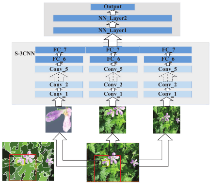
	- [Guanbin Li](https://sites.google.com/site/ligb86/), Yizhou Yu, *__CVPR 2015__*. [[project page]](https://sites.google.com/site/ligb86/mdfsaliency/)
	
	
- __Saliency Detection by Multi-context Deep Learning__
	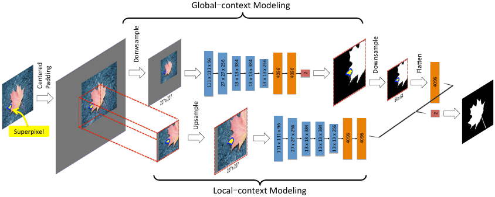
	- [Rui Zhao](http://www.ee.cuhk.edu.hk/~rzhao/), Wanli Ouyang, Hongsheng Li, Xiaogang Wang, *__CVPR 2015__*. [[paper]](http://www.ee.cuhk.edu.hk/~rzhao/project/deepsal_cvpr15/zhaoOLWcvpr15.pdf) [[code]](https://github.com/Robert0812/deepsaldet)
	
	
- __Deep Networks for Saliency Detection via Local Estimation and Global Search__
	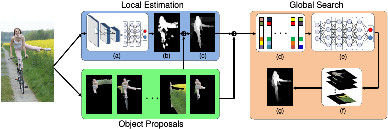
	- Lijun Wang, Huchuan Lu, Xiang Ruan, Ming-Hsuan Yang, *__CVPR 2015__*. [[paper]](http://www.cv-foundation.org/openaccess/content_cvpr_2015/papers/Wang_Deep_Networks_for_2015_CVPR_paper.pdf)
	
	
- __Deep Contrast Learning for Salient Object Detection__
	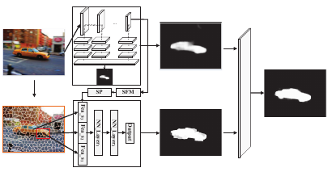
	- [Guanbin Li](https://sites.google.com/site/ligb86/), Yizhou Yu, *__CVPR 2016__*. [[project page]](http://i.cs.hku.hk/~gbli/deep_saliency.html)
	
	
- __Saliency Unified: A Deep Architecture for Simultaneous Eye Fixation Prediction and Salient Object Segmentation__
	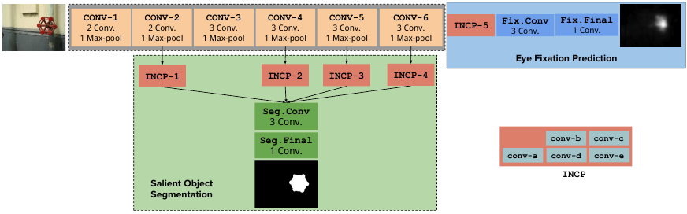
	- Srinivas S S Kruthiventi, Vennela Gudisa, Jaley H Dholakiya and R. Venkatesh Babu, *__CVPR 2016__*. [[project page]](http://val.serc.iisc.ernet.in/saliency-unified/)
	
	
- __Deep Saliency with Encoded Low level Distance Map and High Level Features__
	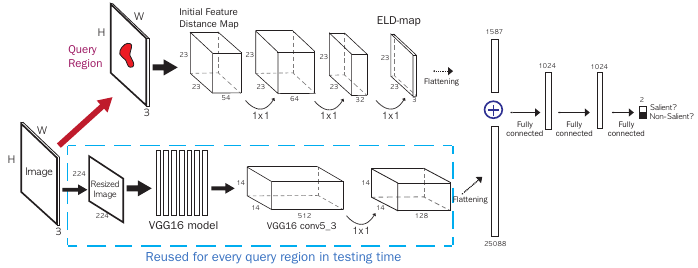
	- Gayoung Lee, Yu-Wing Tai, Junmo Kim, *__CVPR 2016__*. [[paper]](http://www.cv-foundation.org/openaccess/content_cvpr_2016/papers/Lee_Deep_Saliency_With_CVPR_2016_paper.pdf) [[code]](https://github.com/gylee1103/SaliencyELD)
	
	
- __Recurrent Attentional Networks for Saliency Detection__
	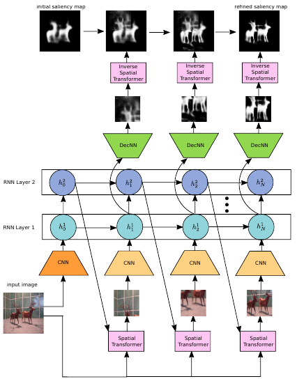
	- Jason Kuen, Zhenhua Wang, Gang Wang, *__CVPR 2016__*. [[paper]](http://www.cv-foundation.org/openaccess/content_cvpr_2016/papers/Kuen_Recurrent_Attentional_Networks_CVPR_2016_paper.pdf)
	
	
- __DeepSaliency: Multi-Task Deep Neural Network Model for Salient Object Detection__
	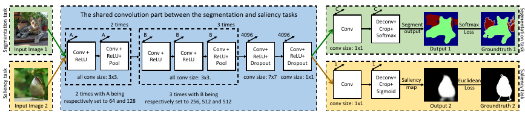
	- Xi Li, Liming Zhao, Lina Wei, Ming-Hsuan Yang, Fei Wu, Yueting Zhuang, Haibin Ling, Jingdong Wang, *__TIP 2016__*. [[project page]](http://www.zhaoliming.net/research/deepsaliency)
	
	
- __A Shape-Based Approach for Salient Object Detection Using Deep Learning__
	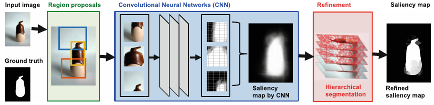
	- [Jongpil Kim](http://www.research.cs.rutgers.edu/~jpkim/) and Vladimir Pavlovic, *__ECCV 2016__*. [[paper]](http://www.research.cs.rutgers.edu/~jpkim/papers/jpkim_eccv2016.pdf) [[Pre-computed Maps]](http://www.research.cs.rutgers.edu/~jpkim/papers/resources/ssd_hs.tar.gz)
	
	
- __Saliency Detection with Recurrent Fully Convolutional Networks__
	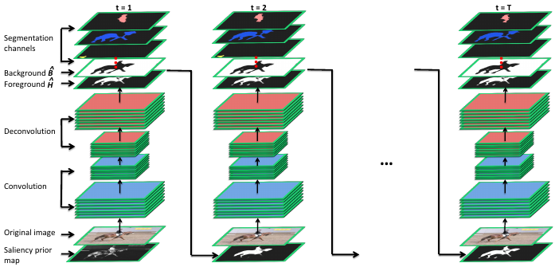
	- Linzhao Wang, Lijun Wang, Huchuan Lu, Pingping Zhang, Xiang Ruan, *__ECCV 2016__*. [[paper]](https://www.researchgate.net/profile/Pingping_Zhang6/publication/308278832_Saliency_Detection_with_Recurrent_Fully_Convolutional_Networks/links/584b5da208aecb6bd8c157e0/Saliency-Detection-with-Recurrent-Fully-Convolutional-Networks.pdf)
	
	
- __Deeply Supervised Salient Object Detection with Short Connections__
	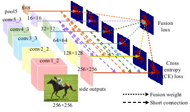
	- Qibin Hou, [Ming-Ming Cheng](http://mmcheng.net/cmm/), Xiaowei Hu, Ali Borji, [Zhuowen Tu](http://pages.ucsd.edu/~ztu/), Philip Torr, *__CVPR 2017__*. [[paper]](https://arxiv.org/abs/1611.04849)
	
	
- __Non-Local Deep Features for Salient Object Detection__
	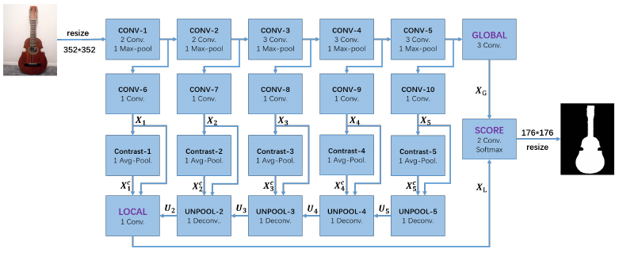
	- Zhiming Luo, Akshaya Mishra , Andrew Achkar , Justin Eichel , Shaozi Li , Pierre-Marc.Jodoin, *__CVPR 2017__*. [[project page]](https://sites.google.com/view/zhimingluo/nldf)
	
	
- __Instance-Level Salient Object Segmentation__
	
	- [Guanbin Li](https://sites.google.com/site/ligb86/), Yuan Xie, Liang Lin, Yizhou Yu, *__CVPR 2017__*. [[paper]](https://arxiv.org/pdf/1704.03604.pdf)
	
	
- __Learning to Detect Salient Objects with Image-level Supervision__
	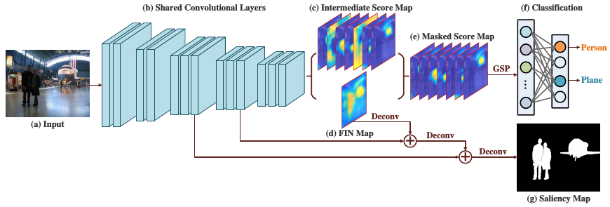
	- Lijun Wang, Huchuan Lu, Yifan Wang, Mengyang Feng, Dong Wang, Baocai Yin , and Xiang Ruan, *__CVPR 2017__*. [[paper]](http://saliencydetection.net/duts/download/camera_ready.pdf)
	
### Object Detection
- __Rich feature hierarchies for accurate object detection and semantic segmentation__
	- Ross Girshick, Jeff Donahue, Trevor Darrell, Jitendra Malik, *__CVPR 2014__*. [[paper]](http://www.cv-foundation.org/openaccess/content_cvpr_2014/papers/Girshick_Rich_Feature_Hierarchies_2014_CVPR_paper.pdf) [[git-hub]](https://github.com/rbgirshick/rcnn)
- __Fast R-CNN__
	- Ross Girshick, *__ICCV 2015__*. [[paper]](http://www.cv-foundation.org/openaccess/content_iccv_2015/papers/Girshick_Fast_R-CNN_ICCV_2015_paper.pdf) [[git-hub]](https://github.com/rbgirshick/fast-rcnn)
- __Faster R-CNN: Towards Real-Time Object Detection with Region Proposal Networks__
	- Shaoqing Ren, [Kaiming He](http://kaiminghe.com/), Ross Girshick, Jian Sun, *__NIPS 2015__*. [[paper]](http://papers.nips.cc/paper/5638-faster-r-cnn-towards-real-time-object-detection-with-region-proposal-networks.pdf) [[matlab]](https://github.com/ShaoqingRen/faster_rcnn) [[python]](https://github.com/rbgirshick/py-faster-rcnn)
- __Convolutional Feature Masking for Joint Object and Stuff Segmentation__
	- Jifeng Dai, [Kaiming He](http://kaiminghe.com/), Jian Sun, *__CVPR 2015__*. [[paper]](http://www.cv-foundation.org/openaccess/content_cvpr_2015/papers/Dai_Convolutional_Feature_Masking_2015_CVPR_paper.pdf)
- __Instance-aware Semantic Segmentation via Multi-task Network Cascades__
	- Jifeng Dai, [Kaiming He](http://kaiminghe.com/), Jian Sun, *__CVPR 2016__*. [[paper]](http://www.cv-foundation.org/openaccess/content_cvpr_2016/papers/Dai_Instance-Aware_Semantic_Segmentation_CVPR_2016_paper.pdf) [[git-hub]](https://github.com/daijifeng001/MNC)
- __R-FCN: Object Detection via Region-based Fully Convolutional Networks__
	- Jifeng Dai, Yi Li,  [Kaiming He](http://kaiminghe.com/), Jian Sun, *__NIPS 2016__*. [[paper]](https://arxiv.org/abs/1605.06409) [[git-hub]](https://github.com/daijifeng001/R-FCN)
- __Feature Pyramid Networks for Object Detection__
	- Tsung-Yi Lin, Piotr Dollár, Ross Girshick, [Kaiming He](http://kaiminghe.com/), Bharath Hariharan, and Serge Belongie, *__CVPR 2017__*. [[paper]](https://arxiv.org/pdf/1612.03144.pdf)
- __Mask R-CNN__
	- Kaiming He, Georgia Gkioxari, Piotr Dollár, Ross Girshick, *__Tech Report__*. [[paper]](https://arxiv.org/abs/1703.06870)
- __A-Fast-RCNN: Hard Positive Generation via Adversary for Object Detection__
	- Xiaolong Wang, Abhinav Shrivastava, Abhinav Gupta, *__CVPR 2017__*. [[paper]](https://arxiv.org/abs/1704.03414) [[git-hub]](https://github.com/xiaolonw/adversarial-frcnn)
- __Multiple Instance Detection Network with Online Instance Classifier Refinement__
	- Peng Tang, Xinggang Wang, Xiang Bai, Wenyu Liu, *__CVPR 2017__*. [[paper]](https://arxiv.org/abs/1704.00138)
	
### Object Localization
- __Simultaneous Detection and Segmentation__
	- Bharath Hariharan, Pablo Arbeláez, Ross Girshick, Jitendra Malik, *__ECCV 2014__*. [[paper]](https://arxiv.org/abs/1407.1808)
- __Deep Self-Taught Learning for Weakly Supervised Object Localization__
	- Zequn Jie, Yunchao Wei, Xiaojie Jin, Jiashi Feng, Wei Liu, *__CVPR 2017__*. [[paper]](https://arxiv.org/abs/1704.05188)
- __Learning Detection with Diverse Proposals__
	- Samaneh Azadi, Jiashi Feng, Trevor Darrell, *__CVPR 2017__*. [[paper]](https://arxiv.org/abs/1704.03533)

### Semantic Segmentation & Scene Parsing
- __Fully Convolutional Networks for Semantic Segmentation__
	- Jonathan Long, Evan Shelhamer, Trevor Darrell, *__CVPR 2015__*. [[paper]](https://people.eecs.berkeley.edu/~jonlong/long_shelhamer_fcn.pdf)
- __Learning to Segment Object Candidates__
	- Pedro O. Pinheiro, Ronan Collobert, Piotr Dollar, *__NIPS 2015__*. [[paper]](http://papers.nips.cc/paper/5852-learning-to-segment-object-candidates.pdf)
- __Learning to Refine Object Segments__
	- Pedro O. Pinheiro , Tsung-Yi Lin , Ronan Collobert, Piotr Doll ́ar, *__arXiv 1603.08695__*. [[paper]](https://arxiv.org/pdf/1603.08695.pdf)
- __Instance-sensitive Fully Convolutional Networks__
	- Jifeng Dai, Kaiming He, Yi Li, Shaoqing Ren, Jian Sun, *__arXiv 1603.08678__*. [[paper]](https://arxiv.org/abs/1603.08678) 
- __Not All Pixels Are Equal: Difficulty-Aware Semantic Segmentation via Deep Layer Cascade__
	- Xiaoxiao Li, Ziwei Liu, Ping Luo, Chen Change Loy, Xiaoou Tang, *__CVPR 2016__*. [[paper]](https://arxiv.org/abs/1704.01344)
- __RefineNet: Multi-Path Refinement Networks for High-Resolution Semantic Segmentation__
	- Guosheng Lin, Anton Milan, Chunhua Shen, Ian Reid, *__arXiv 1611.06612__*. [[paper]](https://arxiv.org/abs/1611.06612)
- __Pyramid Scene Parsing Network__
	- Hengshuang Zhao, Jianping Shi, Xiaojuan Qi, Xiaogang Wang, Jiaya Jia, *__CVPR 2017__*. [[paper]](https://arxiv.org/abs/1612.01105) [[git-hub]](https://github.com/hszhao/PSPNet)
	
### Edge Detection
- __Holistically-Nested Edge Detection__
	- Saining Xie, Zhuowen Tu, *__ICCV 2015__*. [[paper]](http://www.cv-foundation.org/openaccess/content_iccv_2015/papers/Xie_Holistically-Nested_Edge_Detection_ICCV_2015_paper.pdf)
- __Richer Convolutional Features for Edge Detection__
	- Yun Liu, Ming-Ming Cheng, Xiaowei Hu, Kai Wang, Xiang Bai, *__CVPR 2017__*. [[paper]](Yun Liu, Ming-Ming Cheng, Xiaowei Hu, Kai Wang, Xiang Bai)
	
### Pose Estimation
- __Multi-Context Attention for Human Pose Estimation__
	- [Xiao Chu](http://www.ee.cuhk.edu.hk/~xchu/), Wei Yang, [Wanli Ouyang](http://www.ee.cuhk.edu.hk/~wlouyang/), Cheng Ma, Alan L. Yuille, [Xiaogang Wang](http://www.ee.cuhk.edu.hk/~xgwang/), *__CVPR 2017__*. [[paper]](https://arxiv.org/abs/1702.07432) [[git-hub]](https://github.com/bearpaw/pose-attention)
- __Stacked Hourglass Networks for Human Pose Estimation__
	- Alejandro Newell, Kaiyu Yang, and Jia Deng, *__ECCV 2016__*. [[paper]](https://arxiv.org/abs/1603.06937)

### Semantic Matching
- __AnchorNet: A Weakly Supervised Network to Learn Geometry-sensitive Features For Semantic Matching__
	- David Novotny, DianeLarlus, Andrea Vedaldi, *__CVPR 2017__*. [[paper]](https://arxiv.org/abs/1704.04749)
	
### Super Resolution
- __Deep Laplacian Pyramid Networks for Fast and Accurate Super-Resolution__
	- Wei-Sheng Lai, Jia-Bin Huang, Narendra Ahuja, Ming-Hsuan Yang, *__CVPR 2017__*. [[project page]](http://vllab1.ucmerced.edu/~wlai24/LapSRN/)

### Image Classification
- __Residual Attention Network for Image Classification__
	- Fei Wang, Mengqing Jiang, Chen Qian, Shuo Yang, Cheng Li, Honggang Zhang, Xiaogang Wang, Xiaoou Tang, *__CVPR 2017__*. [[paper]](https://arxiv.org/abs/1704.06904)
- __Aggregated Residual Transformations for Deep Neural Networks__
	- Saining Xie, Ross Girshick, Piotr Dollár, Zhuowen Tu, and Kaiming He, *__CVPR 2017__*. [[paper]](https://arxiv.org/abs/1611.05431) [[git-hub]](https://github.com/facebookresearch/ResNeXt)
- __Deep Residual Learning for Image Recognition__
	- Kaiming He, Xiangyu Zhang, Shaoqing Ren, and Jian Sun, *__CVPR 2017__*. [[paper]](https://arxiv.org/abs/1512.03385) [[git-hub]](https://github.com/KaimingHe/deep-residual-networks)
	
### Others
- __Quality Aware Network for Set to Set Recognition__
	- Yu Liu, Junjie Yan, Wanli Ouyang, *__CVPR 2017__*. [[paper]](https://arxiv.org/abs/1704.03373)