## Video Object Segmentation

### 2020
|No.   |Figure   |Title   |Authors  |Pub.  |Links|
|-----|:-----:|:-----:|:-----:|:-----:|:---:|
|24|placeholder|__Learning Discriminative Feature with CRF for Unsupervised Video Object Segmentation__|Mingmin Zhen, Shiwei Li, Lei Zhou, Jiaxiang Shang, Haoan Feng, Tian Fang, Long Quan|__ECCV 2020__|[`paper`](https://arxiv.org/abs/2008.01270)|
|23|placeholder|__CenterNet Heatmap Propagation for Real-time Video Object Detection__|Zhujun Xu, Emir Hrustic, and Damien Vivet|__ECCV 2020__|[`paper`](https://www.ecva.net/papers/eccv_2020/papers_ECCV/papers/123700222.pdf)|
|22|placeholder|__Kernelized Memory Network for Video Object Segmentation__|Hongje Seong, Junhyuk Hyun, Euntai Kim|__ECCV 2020__|[`paper`](https://arxiv.org/abs/2007.08270)|
|21|placeholder|__Interactive Video Object Segmentation Using Global and Local Transfer Modules__|Yuk Heo, Yeong Jun Koh, Chang-Su Kim|__ECCV 2020__|[`paper`](https://arxiv.org/abs/2007.08139)|
|20|placeholder|__URVOS: Unified Referring Video Object Segmentation Network with a Large-Scale Benchmark__|Seonguk Seo, Joon-Young Lee, and Bohyung Han|__ECCV 2020__|[`paper`](https://www.ecva.net/papers/eccv_2020/papers_ECCV/papers/123600205.pdf)|
|19|placeholder|__Unsupervised Video Object Segmentation with Joint Hotspot Tracking__|Lu Zhang, Jianming Zhang, Zhe Lin, Radomır Mech, Huchuan Lu, You He|__ECCV 2020__|[`paper`](https://www.ecva.net/papers/eccv_2020/papers_ECCV/papers/123590477.pdf)|
|18|placeholder|__ScribbleBox: Interactive Annotation Framework for Video Object Segmentation__|Bowen Chen, Huan Ling, Xiaohui Zeng, Gao Jun, Ziyue Xu, Sanja Fidler|__ECCV 2020__|[`paper`](https://arxiv.org/abs/2008.09721)|
|17|placeholder|__STEm-Seg: Spatio-temporal Embeddings for Instance Segmentation in Videos__|Ali Athar, Sabarinath Mahadevan, Aljoša Ošep, Laura Leal-Taixé, Bastian Leibe|__ECCV 2020__|[`paper`](https://arxiv.org/abs/2003.08429)|
|16|placeholder|__Fast Video Object Segmentation using Global Context Module__|Yu Li, Zhuoran Shen, Ying Shan|__ECCV 2020__|[`paper`](https://arxiv.org/abs/2001.11243)|
|15|placeholder|__Efficient Semantic Video Segmentation with Per-frame Inference__|Yifan Liu, Chunhua Shen, Changqian Yu, Jingdong Wang|__ECCV 2020__|[`paper`](https://arxiv.org/abs/2002.11433)|
|14|placeholder|__Learning Object Depth from Camera Motion and Video Object Segmentation__|Brent A. Griffin, Jason J. Corso|__ECCV 2020__|[`paper`](https://arxiv.org/abs/2007.05676)|
|13|placeholder|__Collaborative Video Object Segmentation by Foreground-Background Integration__|Zongxin Yang, Yunchao Wei, Yi Yang|__ECCV 2020__|[`paper`](https://arxiv.org/abs/2003.08333)|
|12|placeholder|__TENet: Triple Excitation Network for Video Salient Object Detection__|Sucheng Ren, Chu Han, Xin Yang, Guoqiang Han, Shengfeng He|__ECCV 2020__|[`paper`](https://arxiv.org/abs/2007.09943)|
|11|placeholder|__Learning What to Learn for Video Object Segmentation__|Goutam Bhat, Felix Järemo Lawin, Martin Danelljan, Andreas Robinson, Michael Felsberg, Luc Van Gool, Radu Timofte|__ECCV 2020__|[`paper`](https://arxiv.org/abs/2003.11540)|
|10|placeholder|__Video Object Segmentation with Graph Memory Network__|Xinkai Lu, Wenguan Wang, Martin Danelljan, Tianfei Zhou, Jianbing Shen, Luc Van Gool|__ECCV 2020__|[`paper`](https://arxiv.org/abs/2007.07020)|
|9|placeholder|__Memory Enhanced Global-Local Aggregation for Video Object Detection__|Yihong Chen, Yue Cao, Han Hu, Liwei Wang|__CVPR 2020__|[`paper`](https://openaccess.thecvf.com/content_CVPR_2020/papers/Chen_Memory_Enhanced_Global-Local_Aggregation_for_Video_Object_Detection_CVPR_2020_paper.pdf)|
|8|placeholder|__Learning Video Object Segmentation from Unlabeled Videos__|Jiyang Yu, Ravi Ramamoorthi|__CVPR 2020__|[`paper`](https://openaccess.thecvf.com/content_CVPR_2020/papers/Lu_Learning_Video_Object_Segmentation_From_Unlabeled_Videos_CVPR_2020_paper.pdf)|
|7|placeholder|__Temporally Distributed Networks for Fast Video Semantic Segmentation__|Ping Hu, Fabian Caba, Oliver Wang, Zhe Lin, Stan Sclaroff, Federico Perazzi|__CVPR 2020__|[`paper`](https://openaccess.thecvf.com/content_CVPR_2020/papers/Hu_Temporally_Distributed_Networks_for_Fast_Video_Semantic_Segmentation_CVPR_2020_paper.pdf)|
|6|placeholder|__Fast Video Object Segmentation With Temporal Aggregation Network and Dynamic Template Matching__|Xuhua Huang, Jiarui Xu, Yu-Wing Tai, Chi-Keung Tang|__CVPR 2020__|[`paper`](https://openaccess.thecvf.com/content_CVPR_2020/papers/Huang_Fast_Video_Object_Segmentation_With_Temporal_Aggregation_Network_and_Dynamic_CVPR_2020_paper.pdf)|
|5|placeholder|__Memory Aggregation Networks for Efficient Interactive Video Object Segmentation__|Jiaxu Miao, Yunchao Wei, Yi Yang|__CVPR 2020__|[`paper`](https://openaccess.thecvf.com/content_CVPR_2020/papers/Miao_Memory_Aggregation_Networks_for_Efficient_Interactive_Video_Object_Segmentation_CVPR_2020_paper.pdf)|
|4|placeholder|__Fast Template Matching and Update for Video Object Tracking and Segmentation__|Mingjie Sun, Jimin Xiao, Eng Gee Lim, Bingfeng Zhang, Yao Zhao|__CVPR 2020__|[`paper`](https://openaccess.thecvf.com/content_CVPR_2020/papers/Sun_Fast_Template_Matching_and_Update_for_Video_Object_Tracking_and_CVPR_2020_paper.pdf)|
|3|placeholder|__A Transductive Approach for Video Object Segmentation__|Yizhuo Zhang, Zhirong Wu, Houwen Peng, Stephen Lin|__CVPR 2020__|[`paper`](https://openaccess.thecvf.com/content_CVPR_2020/papers/Zhang_A_Transductive_Approach_for_Video_Object_Segmentation_CVPR_2020_paper.pdf)|
|2|placeholder|__State-Aware Tracker for Real-Time Video Object Segmentation__|Xi Chen, Zuoxin Li, Ye Yuan, Gang Yu, Jianxin Shen, Donglian Qi|__CVPR 2020__|[`paper`](https://openaccess.thecvf.com/content_CVPR_2020/papers/Chen_State-Aware_Tracker_for_Real-Time_Video_Object_Segmentation_CVPR_2020_paper.pdf)|
|1|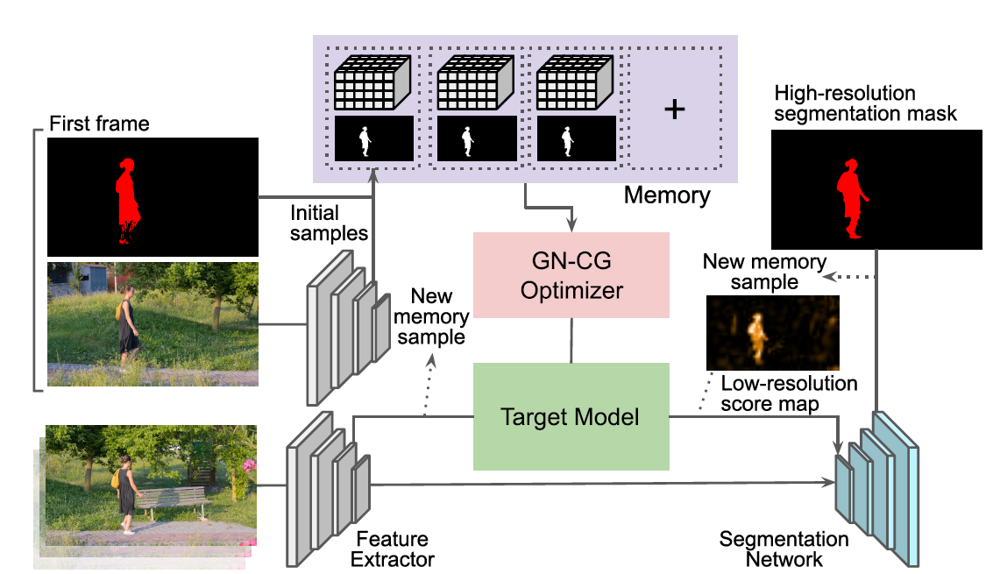|__Learning Fast and Robust Target Models for Video Object Segmentation__|Andreas Robinson, Felix Järemo Lawin, Martin Danelljan, Fahad Shahbaz Khan, Michael Felsberg|__CVPR 2020__|[`paper`](https://openaccess.thecvf.com/content_CVPR_2020/papers/Robinson_Learning_Fast_and_Robust_Target_Models_for_Video_Object_Segmentation_CVPR_2020_paper.pdf)|

### 2019
|No.   |Figure   |Title   |Authors  |Pub.  |Links|
|-----|:-----:|:-----:|:-----:|:-----:|:---:|
|18|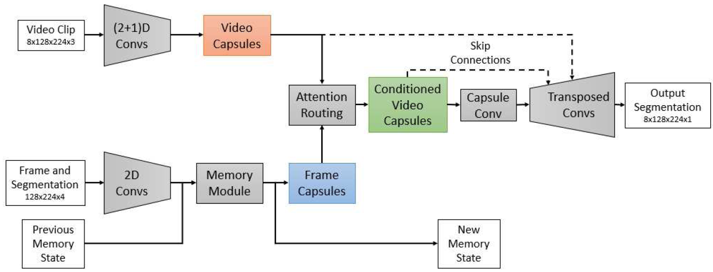|__CapsuleVOS: Semi-Supervised Video Object Segmentation Using Capsule Routing__|Kevin Duarte, Yogesh S. Rawat, Mubarak Shah|__ICCV 2019__|[`paper`](http://openaccess.thecvf.com/content_ICCV_2019/papers/Duarte_CapsuleVOS_Semi-Supervised_Video_Object_Segmentation_Using_Capsule_Routing_ICCV_2019_paper.pdf)|
|17|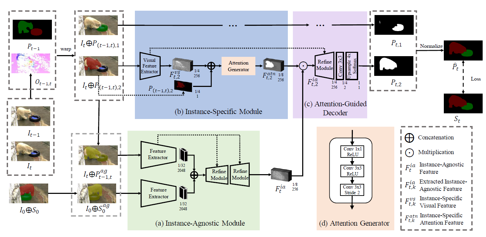|__AGSS-VOS: Attention Guided Single-Shot Video Object Segmentation__|Huaijia Lin, Xiaojuan Qi, Jiaya Jia|__ICCV 2019__|[`paper`](http://openaccess.thecvf.com/content_ICCV_2019/papers/Lin_AGSS-VOS_Attention_Guided_Single-Shot_Video_Object_Segmentation_ICCV_2019_paper.pdf)|
|16|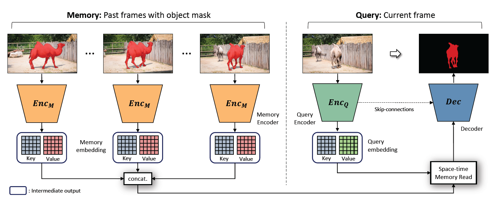|__Video Object Segmentation Using Space-Time Memory Networks__|Seoung Wug Oh, Joon-Young Lee, Ning Xu, Seon Joo Kim|__ICCV 2019__|[`paper`](http://openaccess.thecvf.com/content_ICCV_2019/papers/Oh_Video_Object_Segmentation_Using_Space-Time_Memory_Networks_ICCV_2019_paper.pdf)|
|15|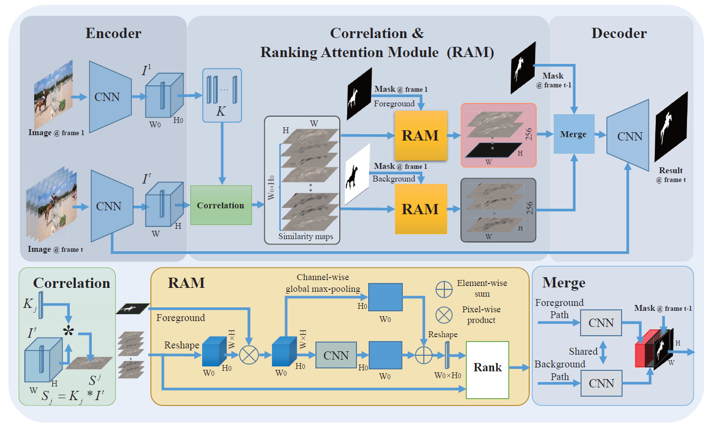|__RANet: Ranking Attention Network for Fast Video Object Segmentation__|Ziqin Wang, Jun Xu, Li Liu, Fan Zhu, Ling Shao|__ICCV 2019__|[`paper`](http://openaccess.thecvf.com/content_ICCV_2019/papers/Wang_RANet_Ranking_Attention_Network_for_Fast_Video_Object_Segmentation_ICCV_2019_paper.pdf)|
|14|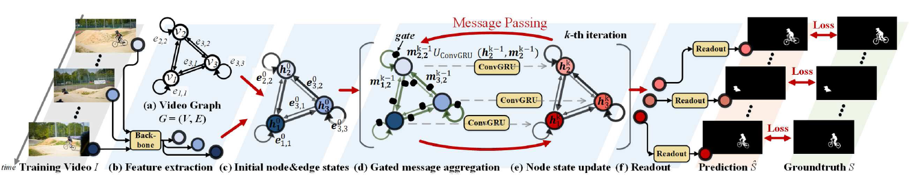|__Zero-Shot Video Object Segmentation via Attentive Graph Neural Networks__|Wenguan Wang, Xiankai Lu, Jianbing Shen, David J. Crandall, Ling Shao|__ICCV 2019__|[`paper`](http://openaccess.thecvf.com/content_ICCV_2019/papers/Wang_Zero-Shot_Video_Object_Segmentation_via_Attentive_Graph_Neural_Networks_ICCV_2019_paper.pdf)|
|13|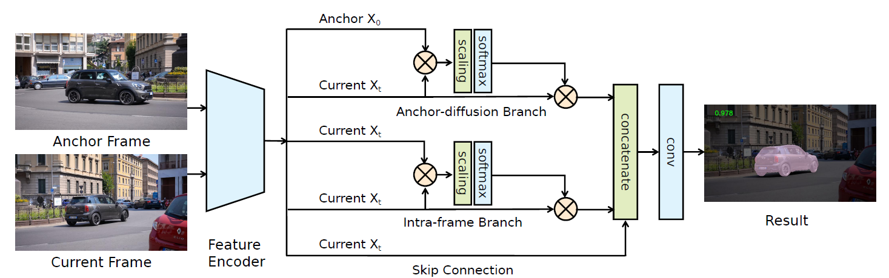|__Anchor Diffusion for Unsupervised Video Object Segmentation__|Zhao Yang, Qiang Wang, Luca Bertinetto, Weiming Hu, Song Bai, Philip H. S. Torr|__ICCV 2019__|[`paper`](http://openaccess.thecvf.com/content_ICCV_2019/papers/Yang_Anchor_Diffusion_for_Unsupervised_Video_Object_Segmentation_ICCV_2019_paper.pdf)|
|12|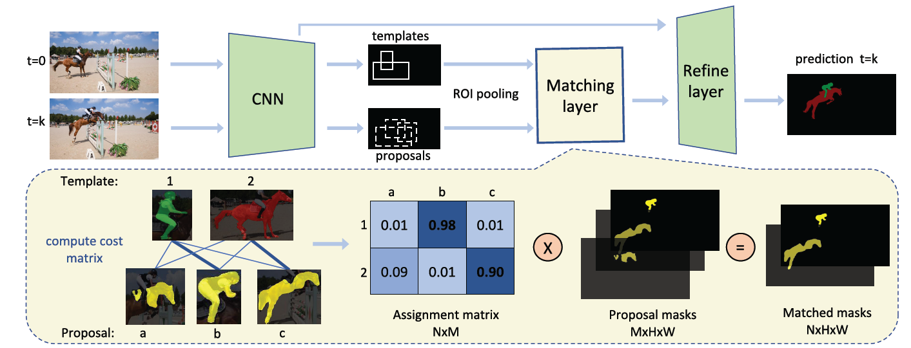|__DMM-Net: Differentiable Mask-Matching Network for Video Object Segmentation__|Chaoxu Guo, Bin Fan, Jie Gu, Qian Zhang, Shiming Xiang, Veronique Prinet, Chunhong Pan|__ICCV 2019__|[`paper`](http://openaccess.thecvf.com/content_ICCV_2019/papers/Guo_Progressive_Sparse_Local_Attention_for_Video_Object_Detection_ICCV_2019_paper.pdf)|
|11|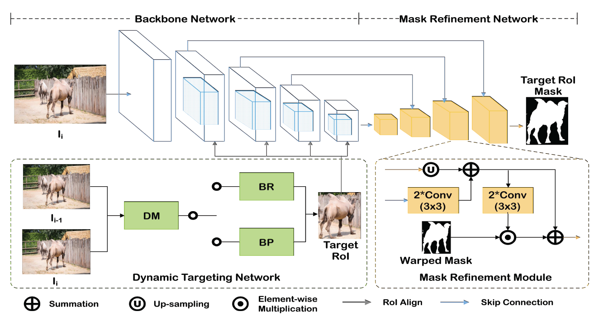|__Fast Video Object Segmentation via Dynamic Targeting Network__|Lu Zhang, Zhe Lin, Jianming Zhang, Huchuan Lu, You He|__ICCV 2019__|[`paper`](http://openaccess.thecvf.com/content_ICCV_2019/papers/Zhang_Fast_Video_Object_Segmentation_via_Dynamic_Targeting_Network_ICCV_2019_paper.pdf)|
|10|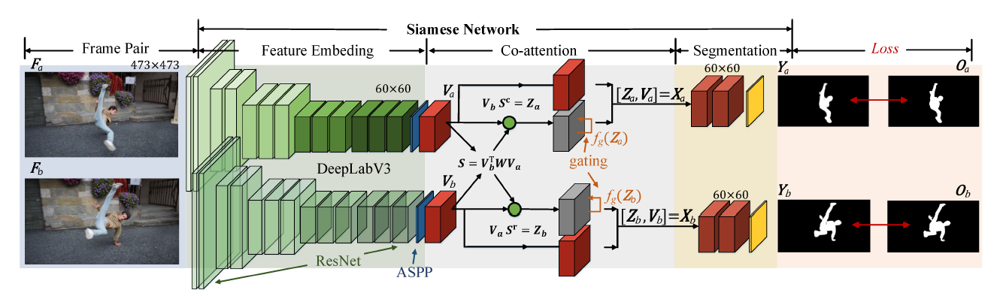|__See More, Know More: Unsupervised Video Object Segmentation With Co-Attention Siamese Networks__|Xiankai Lu, Wenguan Wang, Chao Ma, Jianbing Shen, Ling Shao, Fatih Porikli|__CVPR 2019__|[`paper`](http://openaccess.thecvf.com/content_CVPR_2019/papers/Lu_See_More_Know_More_Unsupervised_Video_Object_Segmentation_With_Co-Attention_CVPR_2019_paper.pdf) [`github`](https://github.com/carrierlxk/COSNet)|
|9|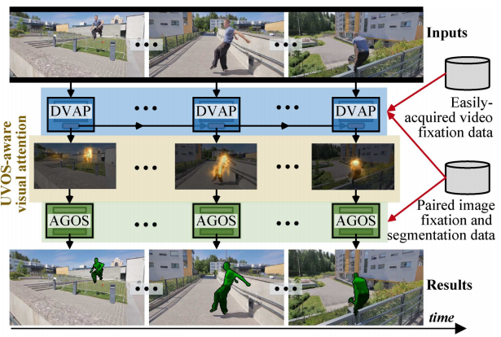|__Learning Unsupervised Video Object Segmentation through Visual Attention__|Wenguan Wang, Hongmei Song, Shuyang Zhao, Jianbing Shen, Sanyuan Zhao, Steven C. H. Hoi and Haibin Ling|__CVPR 2019__|[`paper`](http://openaccess.thecvf.com/content_CVPR_2019/papers/Wang_Learning_Unsupervised_Video_Object_Segmentation_Through_Visual_Attention_CVPR_2019_paper.pdf) [`github`](https://github.com/wenguanwang/AGS)|
|8|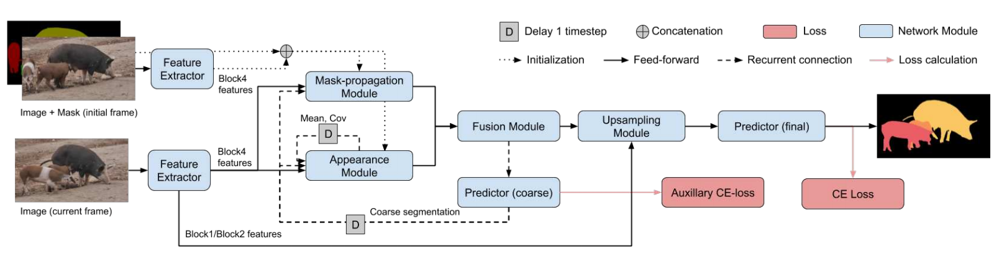|__A Generative Appearance Model for End-to-end Video Object Segmentation__|Joakim Johnander, Martin Danelljan, Emil Brissman, Fahad Shahbaz Khan|__CVPR 2019__|[`paper`](http://openaccess.thecvf.com/content_CVPR_2019/papers/Johnander_A_Generative_Appearance_Model_for_End-To-End_Video_Object_Segmentation_CVPR_2019_paper.pdf) [`github`](https://github.com/joakimjohnander/agame-vos)|
|7|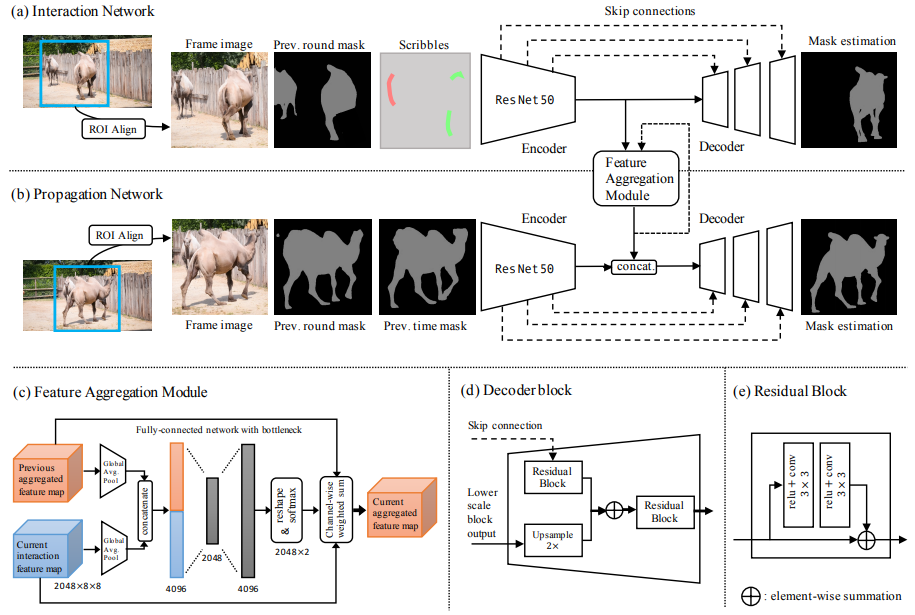|__Fast User-Guided Video Object Segmentation by Interaction-and-Propagation Networks__|Seoung Wug Oh, Joon-Young Lee, Ning Xu, Seon Joo Kim|__CVPR 2019__|[`paper`](https://arxiv.org/pdf/1904.09791.pdf)|
|6|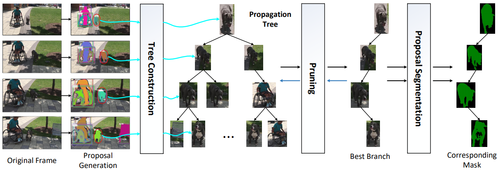|__MHP-VOS: Multiple Hypotheses Propagation for Video Object Segmentation__|Shuangjie Xu1, Daizong Liu, Linchao Bao, Wei Liu, Pan Zhou|__CVPR 2019__|[`github`](https://github.com/shuangjiexu/MHP-VOS)|
|5|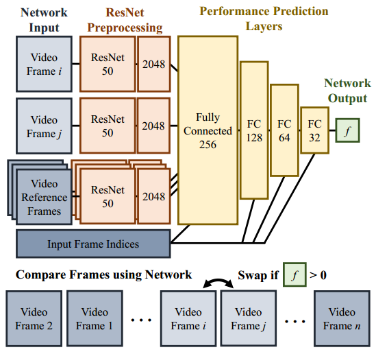|__BubbleNets: Learning to Select the Guidance Frame in Video Object Segmentation by Deep Sorting Frames__|Brent A. Griffin, Jason J. Corso|__CVPR 2019__|[`github`](https://github.com/griffbr/BubbleNets)|
|4|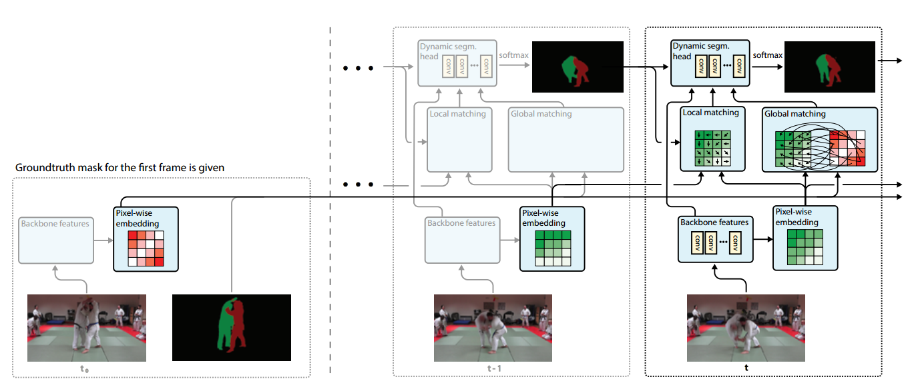|__FEELVOS: Fast End-to-End Embedding Learning for Video Object Segmentation__|Paul Voigtlaender, Yuning Chai, Florian Schroff, Hartwig Adam|__CVPR 2019__|[`github`](https://github.com/tensorflow/models/tree/master/research/feelvos)|
|3|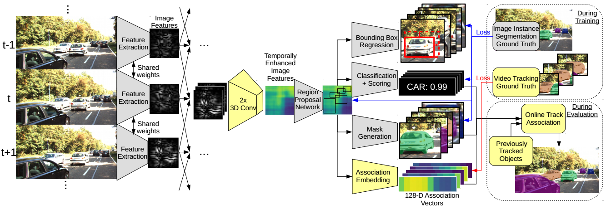|__MOTS: Multi-Object Tracking and Segmentation__|Paul Voigtlaender, Michael Krause, Aljosa O ˘ sep, Jonathon Luiten|__CVPR 2019__|[`project page`](https://www.vision.rwth-aachen.de/page/mots)|
|2|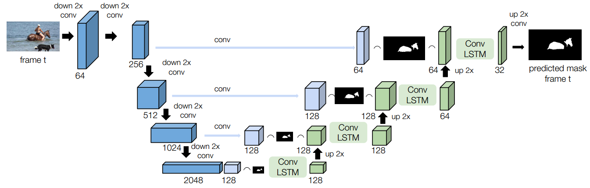|__RVOS: End-to-End Recurrent Network for Video Object Segmentation__|Carles Ventura, Miriam Bellver, Andreu Girbau, Amaia Salvador, Ferran Marques and Xavier Giro-i-Nieto|__CVPR 2019__|[`project page`](https://imatge-upc.github.io/rvos/)|
|1|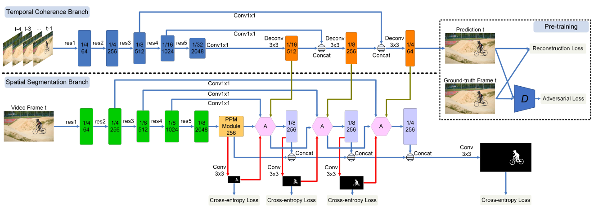|__Spatiotemporal CNN for Video Object Segmentation__|Kai Xu, Longyin Wen, Guorong Li , Liefeng Bo, Qingming Huang|__CVPR 2019__|[`github`](https://github.com/longyin880815/STCNN)|

### 2018
|No.   |Figure   |Title   |Authors  |Pub.  |Links|
|-----|:-----:|:-----:|:-----:|:-----:|:---:|
|19|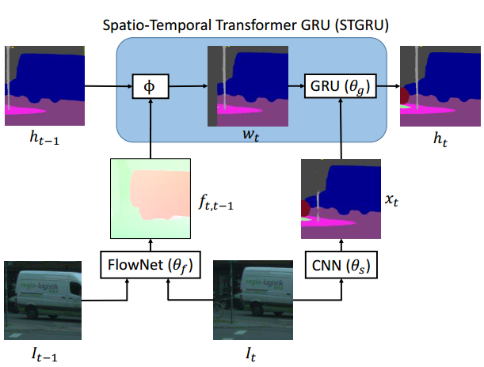|__Semantic Video Segmentation by Gated Recurrent Flow Propagation__|David Nilsson, Cristian Sminchisescu|__CVPR 2018__|[`paper`](http://openaccess.thecvf.com/content_cvpr_2018/papers/Nilsson_Semantic_Video_Segmentation_CVPR_2018_paper.pdf) [`github`](https://github.com/D-Nilsson/GRFP)|
|18|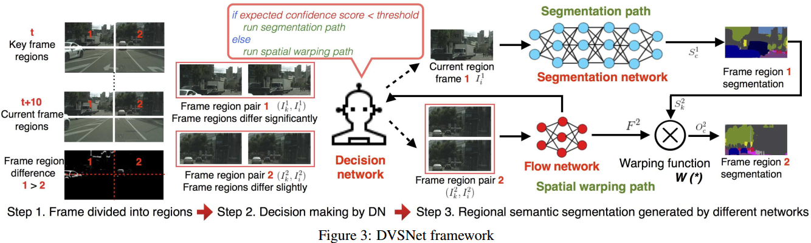|__Dynamic Video Segmentation Network__|Yu-Syuan Xu, Tsu-Jui Fu, Hsuan-Kung Yang, Chun-Yi Lee|__CVPR 2018__|[`paper`](http://openaccess.thecvf.com/content_cvpr_2018/papers/Xu_Dynamic_Video_Segmentation_CVPR_2018_paper.pdf) [`github`](https://github.com/XUSean0118/DVSNet)|
|17||__Unsupervised Video Object Segmentation using Motion Saliency-Guided Spatio-Temporal Propagation__|Yuan-Ting Hu, Jia-Bin Huang, Alexander G. Schwing|__ECCV 2018__|[`paper`](https://arxiv.org/abs/1809.01125v1)|
|16||__Unsupervised Video Object Segmentation with Motion-based Bilateral Networks__|Vik Goel, Jameson Weng, Pascal Poupart|__ECCV 2018__|[`paper`](https://arxiv.org/abs/1805.07780v1)|
|15||__VideoMatch: Matching based Video Object Segmentation__|Yuan-Ting Hu, Jia-Bin Huang, Alexander G. Schwing|__ECCV 2018__|[`paper`](https://arxiv.org/abs/1809.01123v1)|
|14||__Video Object Segmentation by Learning Location-Sensitive Embeddings__|Hai Ci, Chunyu Wang, Yizhou Wang|__ECCV 2018__|[`paper`](http://openaccess.thecvf.com/content_ECCV_2018/html/Hai_Ci_Video_Object_Segmentation_ECCV_2018_paper.html)|
|13||__Low-Latency Video Semantic Segmentation__|Yule Li, Jianping Shi, Dahua Lin|__CVPR 2018__|[`paper`](https://arxiv.org/abs/1804.00389)|
|12||__Instance Embedding Transfer to Unsupervised Video Object Segmentation__|Siyang Li, Bryan Seybold, Alexey Vorobyov, Alireza Fathi, Qin Huang, C.-C. Jay Kuo|__CVPR 2018__|[`paper`](https://arxiv.org/abs/1801.00908)|
|11||__CNN in MRF: Video Object Segmentation via Inference in A CNN-Based Higher-Order Spatio-Temporal MRF__|Linchao Bao, Baoyuan Wu, Wei Liu|__CVPR 2018__|[`paper`](https://arxiv.org/abs/1803.09453)|
|10||__Deep Spatio-Temporal Random Fields for Efficient Video Segmentation__|Siddhartha Chandra, Camille Couprie, Iasonas Kokkinos|__CVPR 2018__|[`paper`](https://arxiv.org/abs/1807.03148)|
|9||__Fast Video Object Segmentation by Reference-Guided Mask Propagation__|Seoung Wug Oh, Joon-Young Lee, Kalyan Sunkavalli, Seon Joo Kim|__CVPR 2018__|[`github`](https://github.com/seoungwugoh/RGMP)|
|8||__MoNet: Deep Motion Exploitation for Video Object Segmentation__|Huaxin Xiao, Jiashi Feng, Guosheng Lin, Yu Liu, Maojun Zhang|__CVPR 2018__|[`paper`](http://openaccess.thecvf.com/content_cvpr_2018/papers/Xiao_MoNet_Deep_Motion_CVPR_2018_paper.pdf)|
|7||__Motion-Guided Cascaded Refinement Network for Video Object Segmentation__|Ping Hu, Gang Wang, Xiangfei Kong , Jason Kuen, Yap-Peng Tan|__CVPR 2018__|[`github`](https://github.com/feinanshan/Motion-Guided-CRN)|
|6||__Reinforcement Cutting-Agent Learning for Video Object Segmentation__|Junwei Han, Le Yang, Dingwen Zhang, Xiaojun Chang, Xiaodan Liang|__CVPR 2018__|[`paper`](http://openaccess.thecvf.com/content_cvpr_2018/papers/Han_Reinforcement_Cutting-Agent_Learning_CVPR_2018_paper.pdf)|
|5||__Fast and Accurate Online Video Object Segmentation via Tracking Parts__|Jingchun Cheng, Yi-Hsuan Tsai, Wei-Chih Hung, Shengjin Wang, Ming-Hsuan Yang|__CVPR 2018__|[`github`](https://github.com/JingchunCheng/FAVOS)|
|4||__Efficient Video Object Segmentation via Network Modulation__|Linjie Yang, Yanran Wang, Xuehan Xiong, Jianchao Yang, Aggelos K. Katsaggelos|__CVPR 2018__|[`github`](https://github.com/linjieyangsc/video_seg)|
|3||__Blazingly Fast Video Object Segmentation with Pixel-Wise Metric Learning__|Yuhua Chen, Jordi Pont-Tuset, Alberto Montes, Luc Van Gool|__CVPR 2018__|[`project page`](https://github.com/yuhuayc/fast-vos)|
|2||__Actor and Action Video Segmentation from a Sentence__|Kirill Gavrilyuk, Amir Ghodrati, Zhenyang Li, Cees G. M. Snoek|__CVPR 2018__|[`project page`](https://kgavrilyuk.github.io/publication/actor_action/)|
|1||__Video Object Segmentation with Joint Re-identification and Attention-Aware Mask Propagation__|Xiaoxiao Li, Chen Change Loy|__ECCV 2018__|[`project page`](https://deeplearn.org/arxiv/28892/video-object-segmentation-with-joint-re-identification-and-attention-aware-mask-propagation)|

### 2017
|No.   |Figure   |Title   |Authors  |Pub.  |Links|
|-----|:-----:|:-----:|:-----:|:-----:|:---:|
|11|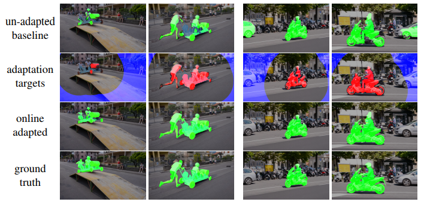|__Online Adaptation of Convolutional Neural Networks for Video Object Segmentation__|Paul Voigtlaender, Bastian Leibe|__BMVC 2017__|[`paper`](https://arxiv.org/pdf/1706.09364.pdf)[`code`](https://www.vision.rwth-aachen.de/software/OnAVOS)|
|10|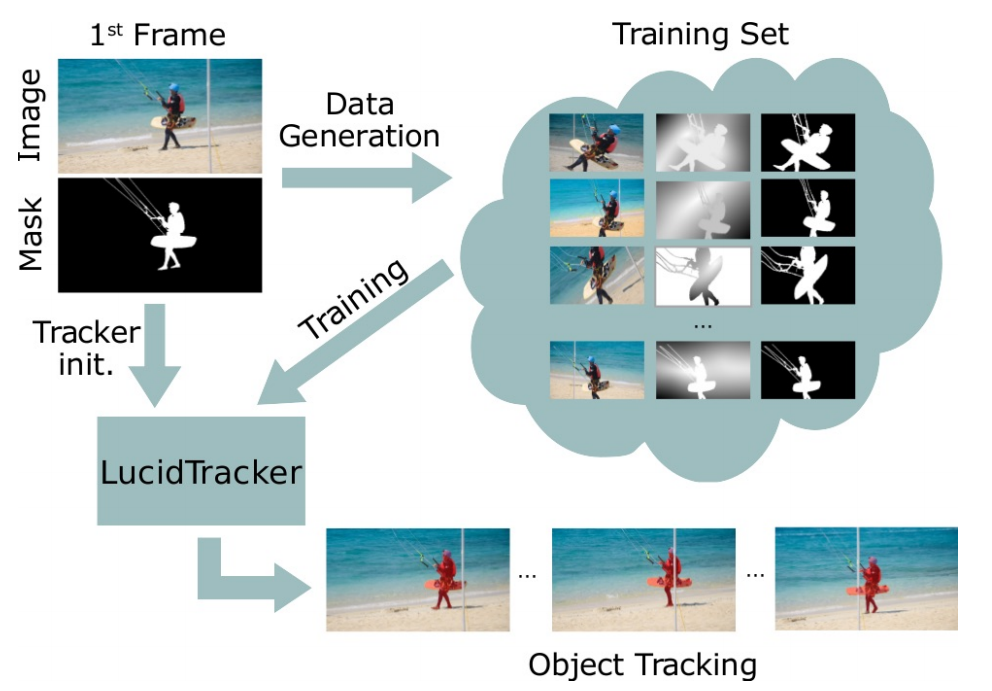|__Lucid Data Dreaming for Video Object Segmentation__|Anna Khoreva, Rodrigo Benenson, Eddy Ilg, Thomas Brox, Bernt Schiele|__IJCV 2019__|[`github`](https://github.com/ankhoreva/LucidDataDreaming)|
|9||__MaskRNN: Instance Level Video ObjectSegmentation__|Yuan-Ting Hu, Jia-Bin Huang, Alexander G. Schwing|__NIPS 2017__|[`project page`](https://sites.google.com/view/yuantinghu/maskrnn)|
|8||__SegFlow: Joint Learning for Video Object Segmentation and Optical Flow__|Jingchun Cheng, Yi-Hsuan Tsai, Shengjin Wang, Ming-Hsuan Yang|__ICCV 2017__|[`github`](https://github.com/JingchunCheng/SegFlow)|
|7||__Pixel-Level Matching for Video Object Segmentation using Convolutional Neural Networks__|Jae Shin Yoon, Francois Rameau, Junsik Kim, Seokju Lee, Seunghak Shin, In So Kweon|__ICCV 2017__|[`project page`](https://jsyoon4325.wixsite.com/pix-matching)|
|6||__Learning Video Object Segmentation with Visual Memory__|Pavel Tokmakov, Karteek Alahari, Cordelia Schmid|__ICCV 2017__|[`paper`](https://arxiv.org/abs/1704.05737)|
|5||__One-Shot Video Object Segmentation__|Sergi Caelles, Kevis-Kokitsi Maninis, Jordi Pont-Tuset, Laura Leal-Taixé, Daniel Cremers, Luc Van Gool|__CVPR 2017__|[`project page`](http://www.vision.ee.ethz.ch/~cvlsegmentation/osvos/)|
|4||__Learning Video Object Segmentation from Static Images__|Anna Khoreva, Federico Perazzi, Rodrigo Benenson, Bernt Schiele, Alexander Sorkine-Hornung|__CVPR 2017__|[`project page`](https://graphics.ethz.ch/~perazzif/masktrack/index.html) [`code`(unofficial)](https://github.com/omkar13/MaskTrack)|
|3||__Learning Motion Patterns in Videos__|Pavel Tokmakov, Karteek Alahari, Cordelia Schmid|__CVPR 2017__|[`project page`](http://thoth.inrialpes.fr/research/mpnet/)|
|2||__FusionSeg: Learning to combine motion and appearance for fully automatic segmentation of generic objects in videos__|Suyog Dutt Jain, Bo Xiong, Kristen Grauman|__CVPR 2017__|[`project page`](http://vision.cs.utexas.edu/projects/fusionseg/)|
|1||__Video Propagation Networks__|Varun Jampani, Raghudeep Gadde, Peter V. Gehler|__CVPR 2017__|[`project page`](https://varunjampani.github.io/vpn/)|

### 2016
|No.   |Figure   |Title   |Authors  |Pub.  |Links|
|-----|:-----:|:-----:|:-----:|:-----:|:---:|
|4||__Semantic Co-segmentation in Videos__|Yi-Hsuan Tsai, Guangyu Zhong, Ming-Hsuan Yang|__ECCV 2016__|[`github`](https://github.com/GYZHikari/semantic-cosegmentation)|
|3||__Video Segmentation via Object Flow__|Yi-Hsuan Tsai, Ming-Hsuan Yang, Michael J. Black|__CVPR 2016__|[`github`](https://github.com/wasidennis/ObjectFlow)|
|2||__Feature Space Optimization for Semantic Video Segmentation__|Abhijit Kundu, Vibhav Vineet, Vladlen Koltun|__CVPR 2016__|[`project page`](http://vladlen.info/publications/feature-space-optimization-for-semantic-video-segmentation/fso/)|
|1||__Bilateral Space Video Segmentation__|Nicolas Marki, Federico Perazzi, Oliver Wang, Alexander Sorkine-Hornung|__CVPR 2016__|[`project page`](https://graphics.ethz.ch/~perazzif/bvs/index.html)|
