## Video Object Segmentation
### 2018
|No.   |Figure   |Title   |Authors  |Pub.  |Links|
|-----|:-----:|:-----:|:-----:|:-----:|:---:|
|17|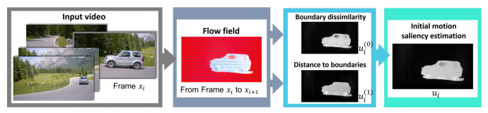|__Unsupervised Video Object Segmentation using Motion Saliency-Guided Spatio-Temporal Propagation__|Yuan-Ting Hu, Jia-Bin Huang, Alexander G. Schwing|__ECCV 2018__|[`paper`](https://arxiv.org/abs/1809.01125v1)|
|16|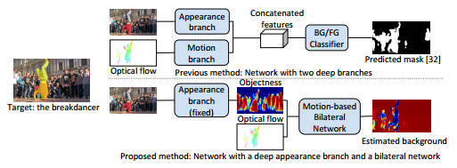|__Unsupervised Video Object Segmentation with Motion-based Bilateral Networks__|Vik Goel, Jameson Weng, Pascal Poupart|__ECCV 2018__|[`paper`](https://arxiv.org/abs/1805.07780v1)|
|15|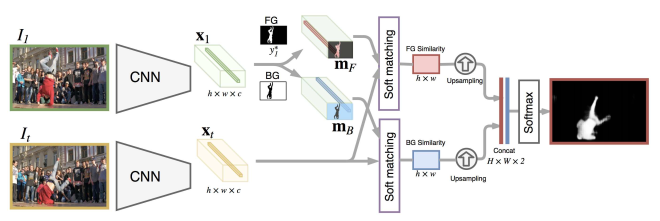|__VideoMatch: Matching based Video Object Segmentation__|Yuan-Ting Hu, Jia-Bin Huang, Alexander G. Schwing|__ECCV 2018__|[`paper`](https://arxiv.org/abs/1809.01123v1)|
|14|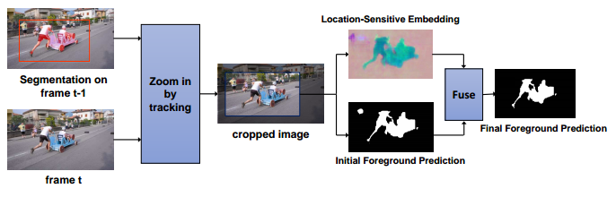|__Video Object Segmentation by Learning Location-Sensitive Embeddings__|Hai Ci, Chunyu Wang, Yizhou Wang|__ECCV 2018__|[`paper`](http://openaccess.thecvf.com/content_ECCV_2018/html/Hai_Ci_Video_Object_Segmentation_ECCV_2018_paper.html)|
|13|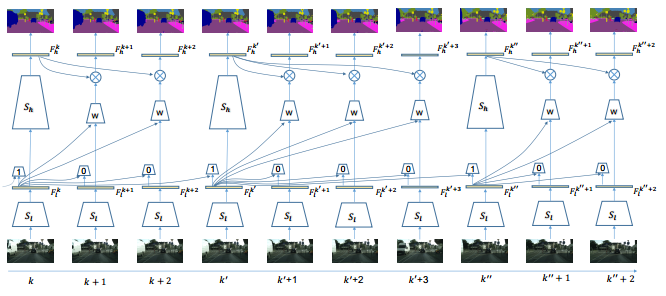|__Low-Latency Video Semantic Segmentation__|Yule Li, Jianping Shi, Dahua Lin|__CVPR 2018__|[`paper`](https://arxiv.org/abs/1804.00389)|
|12|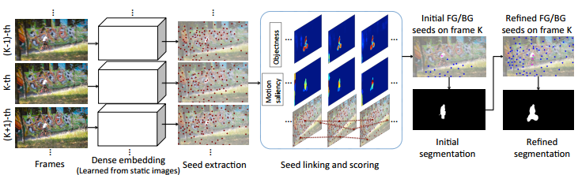|__Instance Embedding Transfer to Unsupervised Video Object Segmentation__|Siyang Li, Bryan Seybold, Alexey Vorobyov, Alireza Fathi, Qin Huang, C.-C. Jay Kuo|__CVPR 2018__|[`paper`](https://arxiv.org/abs/1801.00908)|
|11|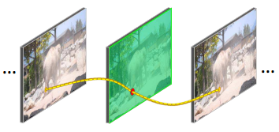|__CNN in MRF: Video Object Segmentation via Inference in A CNN-Based Higher-Order Spatio-Temporal MRF__|Linchao Bao, Baoyuan Wu, Wei Liu|__CVPR 2018__|[`paper`](https://arxiv.org/abs/1803.09453)|
|10||__Deep Spatio-Temporal Random Fields for Efficient Video Segmentation__|Siddhartha Chandra, Camille Couprie, Iasonas Kokkinos|__CVPR 2018__|[`paper`](https://arxiv.org/abs/1807.03148)|
|9|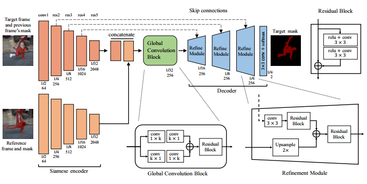|__Fast Video Object Segmentation by Reference-Guided Mask Propagation__|Seoung Wug Oh, Joon-Young Lee, Kalyan Sunkavalli, Seon Joo Kim|__CVPR 2018__|[`github`](https://github.com/seoungwugoh/RGMP)|
|8|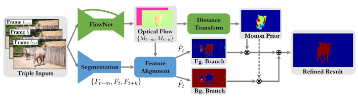|__MoNet: Deep Motion Exploitation for Video Object Segmentation__|Huaxin Xiao, Jiashi Feng, Guosheng Lin, Yu Liu, Maojun Zhang|__CVPR 2018__|[`paper`](http://openaccess.thecvf.com/content_cvpr_2018/papers/Xiao_MoNet_Deep_Motion_CVPR_2018_paper.pdf)|
|7|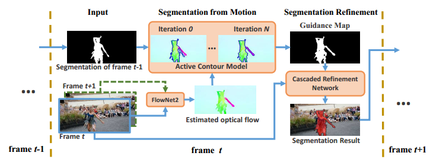|__Motion-Guided Cascaded Refinement Network for Video Object Segmentation__|Ping Hu, Gang Wang, Xiangfei Kong , Jason Kuen, Yap-Peng Tan|__CVPR 2018__|[`github`](https://github.com/feinanshan/Motion-Guided-CRN)|
|6|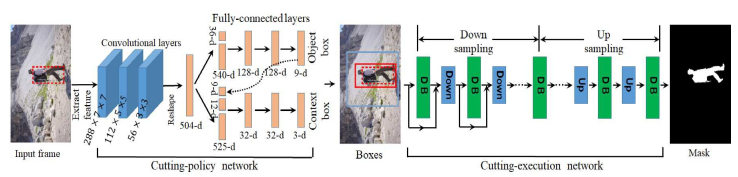|__Reinforcement Cutting-Agent Learning for Video Object Segmentation__|Junwei Han, Le Yang, Dingwen Zhang, Xiaojun Chang, Xiaodan Liang|__CVPR 2018__|[`paper`](http://openaccess.thecvf.com/content_cvpr_2018/papers/Han_Reinforcement_Cutting-Agent_Learning_CVPR_2018_paper.pdf)|
|5|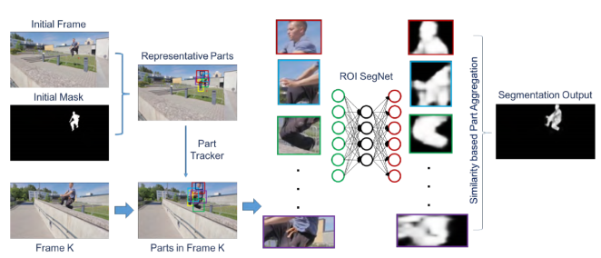|__Fast and Accurate Online Video Object Segmentation via Tracking Parts__|Jingchun Cheng, Yi-Hsuan Tsai, Wei-Chih Hung, Shengjin Wang, Ming-Hsuan Yang|__CVPR 2018__|[`github`](https://github.com/JingchunCheng/FAVOS)|
|4|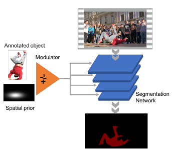|__Efficient Video Object Segmentation via Network Modulation__|Linjie Yang, Yanran Wang, Xuehan Xiong, Jianchao Yang, Aggelos K. Katsaggelos|__CVPR 2018__|[`github`](https://github.com/linjieyangsc/video_seg)|
|3|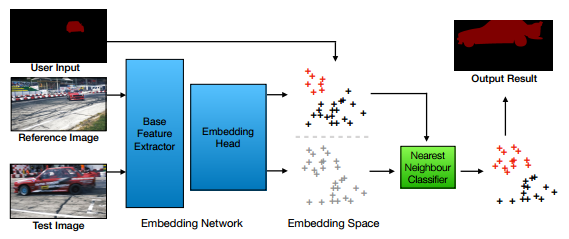|__Blazingly Fast Video Object Segmentation with Pixel-Wise Metric Learning__|Yuhua Chen, Jordi Pont-Tuset, Alberto Montes, Luc Van Gool|__CVPR 2018__|[`project page`](https://github.com/yuhuayc/fast-vos)|
|2|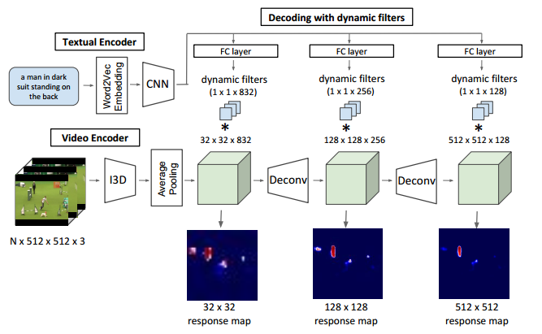|__Actor and Action Video Segmentation from a Sentence__|Kirill Gavrilyuk, Amir Ghodrati, Zhenyang Li, Cees G. M. Snoek|__CVPR 2018__|[`project page`](https://kgavrilyuk.github.io/publication/actor_action/)|
|1|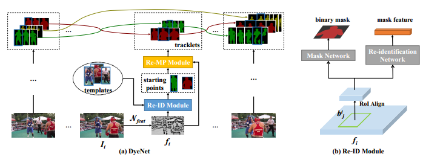|__Video Object Segmentation with Joint Re-identification and Attention-Aware Mask Propagation__|Xiaoxiao Li, Chen Change Loy|__ECCV 2018__|[`project page`](https://deeplearn.org/arxiv/28892/video-object-segmentation-with-joint-re-identification-and-attention-aware-mask-propagation)|

### 2017
|No.   |Figure   |Title   |Authors  |Pub.  |Links|
|-----|:-----:|:-----:|:-----:|:-----:|:---:|
|9|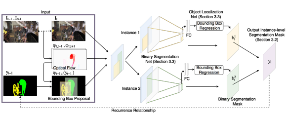|__MaskRNN: Instance Level Video ObjectSegmentation__|Yuan-Ting Hu, Jia-Bin Huang, Alexander G. Schwing|__NIPS 2017__|[`project page`](https://sites.google.com/view/yuantinghu/maskrnn)|
|8|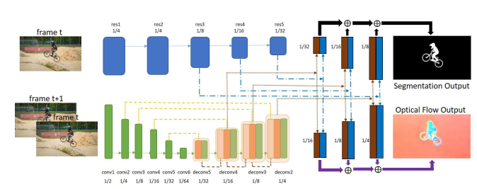|__SegFlow: Joint Learning for Video Object Segmentation and Optical Flow__|Jingchun Cheng, Yi-Hsuan Tsai, Shengjin Wang, Ming-Hsuan Yang|__ICCV 2017__|[`github`](https://github.com/JingchunCheng/SegFlow)|
|7|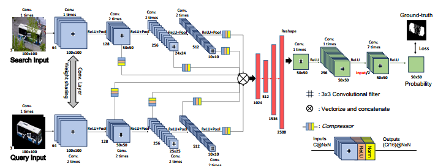|__Pixel-Level Matching for Video Object Segmentation using Convolutional Neural Networks__|Jae Shin Yoon, Francois Rameau, Junsik Kim, Seokju Lee, Seunghak Shin, In So Kweon|__ICCV 2017__|[`project page`](https://jsyoon4325.wixsite.com/pix-matching)|
|6|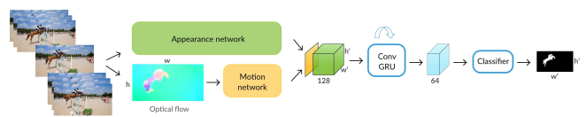|__Learning Video Object Segmentation with Visual Memory__|Pavel Tokmakov, Karteek Alahari, Cordelia Schmid|__ICCV 2017__|[`paper`](https://arxiv.org/abs/1704.05737)|
|5|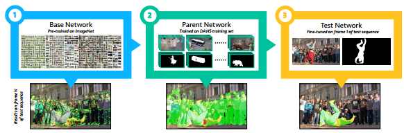|__One-Shot Video Object Segmentation__|Sergi Caelles, Kevis-Kokitsi Maninis, Jordi Pont-Tuset, Laura Leal-Taixé, Daniel Cremers, Luc Van Gool|__CVPR 2017__|[`project page`](http://www.vision.ee.ethz.ch/~cvlsegmentation/osvos/)|
|4|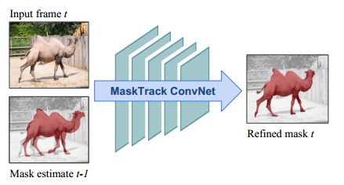|__Learning Video Object Segmentation from Static Images__|Anna Khoreva, Federico Perazzi, Rodrigo Benenson, Bernt Schiele, Alexander Sorkine-Hornung|__CVPR 2017__|[`project page`](https://graphics.ethz.ch/~perazzif/masktrack/index.html)|
|3||__Learning Motion Patterns in Videos__|Pavel Tokmakov, Karteek Alahari, Cordelia Schmid|__CVPR 2017__|[`project page`](http://thoth.inrialpes.fr/research/mpnet/)|
|2|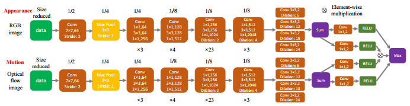|__FusionSeg: Learning to combine motion and appearance for fully automatic segmentation of generic objects in videos__|Suyog Dutt Jain, Bo Xiong, Kristen Grauman|__CVPR 2017__|[`project page`](http://vision.cs.utexas.edu/projects/fusionseg/)|
|1|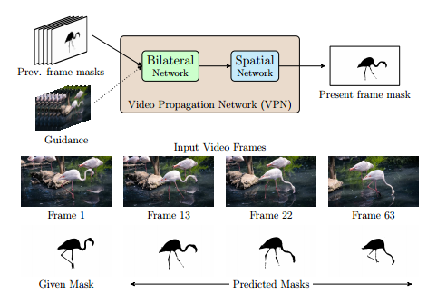|__Video Propagation Networks__|Varun Jampani, Raghudeep Gadde, Peter V. Gehler|__CVPR 2017__|[`project page`](https://varunjampani.github.io/vpn/)|

### 2016
|No.   |Figure   |Title   |Authors  |Pub.  |Links|
|-----|:-----:|:-----:|:-----:|:-----:|:---:|
|4|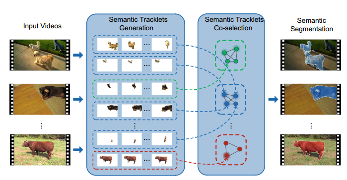|__Semantic Co-segmentation in Videos__|Yi-Hsuan Tsai, Guangyu Zhong, Ming-Hsuan Yang|__ECCV 2016__|[`github`](https://github.com/GYZHikari/semantic-cosegmentation)|
|3|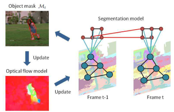|__Video Segmentation via Object Flow__|Yi-Hsuan Tsai, Ming-Hsuan Yang, Michael J. Black|__CVPR 2016__|[`github`](https://github.com/wasidennis/ObjectFlow)|
|2|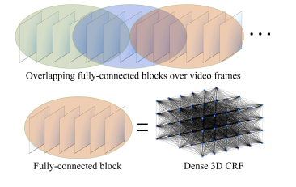|__Feature Space Optimization for Semantic Video Segmentation__|Abhijit Kundu, Vibhav Vineet, Vladlen Koltun|__CVPR 2016__|[`project page`](http://vladlen.info/publications/feature-space-optimization-for-semantic-video-segmentation/fso/)|
|1|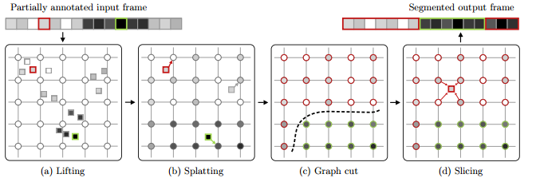|__Bilateral Space Video Segmentation__|Nicolas Marki, Federico Perazzi, Oliver Wang, Alexander Sorkine-Hornung|__CVPR 2016__|[`project page`](https://graphics.ethz.ch/~perazzif/bvs/index.html)|
